# بيان السنة | Bayan Al-Sunnah
### منصة الذكاء الاصطناعي لخدمة الحديث الشريف وعلومه — مبنية على Open WebUI
### Intelligent Hadith Analytics & Isnad Verification Platform — Built on Open WebUI

---

[](hadith/LICENSE)
[](LICENSE)
[-brightgreen.svg)](#-التحقق-الآلي-والتشغيل-السريع-للمحكمين--evaluation--quick-test)
[](#-النواة-المهارية-السباعية-والأدوات--7-skills--6-tools)
[](#)
[](#)
[](#)
[](#)

---

## 🏆 ملخص الهاكاثون وموجز التحكيم | Hackathon Showcase

> **بيان السنة (Bayan Al-Sunnah)** هو نظام ذكاء اصطناعي بحثي سيادي يحل المشكلة الأكبر لنماذج اللغة التوليدية (LLMs) في العلوم الشرعية: **معضلة الهلوسة وتلفيق الأسانيد وضعف التوثيق**.  
> تم بناء النظام فوق منصة **[Open WebUI](https://github.com/open-webui/open-webui)** ليعمل كمنظومة متكاملة تجمع بين منهجيات علماء الحديث الأصولية وأحدث خوارزميات نظرية المخططات (Graph Theory DAG)، والبحث الدلالي اللحظي، والتحقق الصارم عبر **بوابة الدليل (Evidence Gate)**.

### 🌟 الركائز الابتكارية الأربع للمشروع:

1. **🛡️ سياسة صفر هلوسة وبوابة الدليل الصارم (The Evidence Gate):**
   - حظر تام لاقتباس أي حديث من ذاكرة النموذج المجردة؛ كل نص نبوي يُسترجع وجوباً بمعرفه الثابت (`occurrence_id`) من قواعد البيانات المعتمدة محلياً.
   - **النزاهة التوثيقية المطلقة:** إذا خلت بيانات المصدر المسترجع من تفاصيل الطبعة والناشر، يُلزم النموذج بكتابة `(غير متاح في المصدر المسترجع)` ويُحظر عليه اختلاق أسماء دور نشر أو محققين.

2. **🌳 شجرة الإسناد البصرية بنظرية المخططات (Mathematical Isnad DAG):**
   - تحويل أسانيد الحديث إلى مخططات تدفق بصرية وانسيابية فائقة النقاء (Mermaid TD).
   - **احترام المنتهى الحقيقي للحديث:** التمييز الصارم بين **المرفوع** (ينتهي بالنبي ﷺ)، **الموقوف** (ينتهي بالصحابي دون قمة نبوية صناعية)، **المقطوع** (ينتهي بالتابعي)، و**المرسل** (سقوط الصحابي بخط متقطع يوضح الإرسال دون اختراع صحابي وهمي).
   - توحيد العقد بالهوية المحققة (`narrator_id`) لمنع تكرار الرواة وتجنب تشويه الرسم.

3. **🎯 التجربة المزدوجة والمحرك التكيفي (Dual-Track Adaptive Engine):**
   - **مسار التحقيق التخصصي:** للعلماء والباحثين (تخريج مقارن في الكتب الستة، سرد الأسانيد دون حذف `...`، شجرة ميرميد، نقد الرجال).
   - **مسار التعريف بالإسلام (Da'wah Track):** لغير المسلمين وحديثي العهد بالإسلام والمعلمين، يغطي 6 محاور كبرى (الإيمان، الرحمة، العبادة، الأسرة، العدل، العلم) بقوالب تعليمية راقية مع الاحتفاظ بـ `needs_review` والتحقق الدلالي.

4. **⚡ السيادة التقنية والعمل دون إنترنت (100% Offline Capable):**
   - يعمل بكفاءة تامة بدون اتصال خارجي عبر قواعد بيانات SQLite محلية تضم أكثر من **115 ألف راوٍ** و**60 ألف حديث** وفهرس بحث بالنص الكامل (FTS5).

---

## 🏛️ المخطط المعماري للمنظومة | System Architecture

```mermaid
flowchart TD
    User["المستفيد: باحث شرعي أو معرّف بالإسلام أو مستكشف"] --> Pilot["bayan-unified-pilot<br/>المساعد الموحد التجريبي (gpt-5.4-mini)"]
    
    subgraph SkillsCore ["النواة المهارية السباعية المعتمدة (7 Core Skills)"]
        S1["🔍 hadith-search-record<br/>البحث المتني وفتح السجل الدقيق"]
        S2["⚖️ hadith-takhrij-compare<br/>التخريج المقارن في الكتب الستة"]
        S3["🌳 hadith-mermaid-architect<br/>مهندس شجرة الإسناد البصرية DAG"]
        S4["📖 hadith-sharh-scholar<br/>شارح الحديث ومستنبط الفوائد"]
        S5["👤 hadith-rijal-critic<br/>ناقد الأسانيد ومحقق الرجال والعلل"]
        S6["📑 hadith-source-provenance<br/>توثيق المصادر وبوابة الدليل الرقمي"]
        S7["🌟 hadith-islam-guide<br/>دليل المعرّف بالإسلام والمحاور الستة"]
    end

    Pilot --> SkillsCore

    subgraph DataEngine ["محركات وأدوات التحقيق المحلية (6 Native Tools)"]
        T1["hadith_corpus_search<br/>(60k+ حديث في 18 ديواناً)"]
        T2["hadith_takhrij<br/>(الدرر السنية وأحكام الأئمة)"]
        T3["hadith_sharh_vocab<br/>(HadeethEnc + غريب الحديث)"]
        T4["hadith_narrator<br/>(115k+ راوٍ وتراجم الجرح والتعديل)"]
        T5["hadith_isnad_tree<br/>(أشجار الأسانيد والمسارات)"]
        T6["hadith_bayan_topics<br/>(حزم موضوعات التعريف بالإسلام)"]
    end

    SkillsCore --> DataEngine

    DataEngine --> EvidenceGate{"بوابة الدليل الصارم<br/>Evidence Gate<br/>0% Hallucination"}
    
    EvidenceGate --> AdaptiveOut["المحرك التكيفي لصياغة الناتج:<br/>• جواب مباشر وموجز للأسئلة البسيطة<br/>• بطاقة دعوية للمسار التعريفي<br/>• تقرير حديثي شامل وشجرة DAG عند طلب التخريج"]

    classDef pilot fill:#1e293b,stroke:#f59e0b,stroke-width:2px,color:#fef3c7,font-weight:bold;
    classDef skill fill:#1e1b4b,stroke:#6366f1,stroke-width:1.5px,color:#e0e7ff;
    classDef tool fill:#064e3b,stroke:#10a37f,stroke-width:1.5px,color:#ecfdf5;
    classDef gate fill:#7f1d1d,stroke:#ef4444,stroke-width:2px,color:#fee2e2,font-weight:bold;
    classDef out fill:#0f172a,stroke:#38bdf8,stroke-width:2px,color:#f0f9ff;

    class Pilot pilot;
    class S1,S2,S3,S4,S5,S6,S7 skill;
    class T1,T2,T3,T4,T5,T6 tool;
    class EvidenceGate gate;
    class AdaptiveOut out;
```



---

## 🧪 التحقق الآلي والتشغيل السريع للمحكمين | Evaluation & Quick Test

يمكن للمحكمين والوكلاء الذكاء الاصطناعي (AI Reviewer Agents) تشغيل حزمة الفحص الشاملة بضغطة زر واحدة:

```bash
# تشغيل حزمة التحقق الموحدة لبيان السنة (39 اختباراً مؤتمتاً)
python hadith/tests/run_all_tests.py
```

### نتيجة التشغيل المعتمدة (100% Success Rate):
```text
===========================================================================
 🌟 BAYAN AL-SUNNAH (بيان السنة) - MASTER VERIFICATION RUNNER
 Automated Hackathon Evaluation & Scientific Verification Suite
===========================================================================
▶ Running: Bayan Topics & Semantic Exclusion (12 Tests)...   -> ✅ PASSED (0.71s)
▶ Running: Hadith Backend Integration (7 Tests)...           -> ✅ PASSED (8.08s)
▶ Running: Isnad Linkage & Graph Rigor (13 Tests)...         -> ✅ PASSED (3.48s)
▶ Running: Unified Architecture U01-U08 Acceptance (7 Suites)-> ✅ PASSED (0.55s)
===========================================================================
 📊 EXECUTIVE VERIFICATION SUMMARY: 39/39 PASSED (100%)
===========================================================================
```

---

## 🧩 النواة المهارية السباعية والأدوات | 7 Skills & 6 Tools

| المهارة في Open WebUI | الوظيفة العلمية | الأداة المرتبطة |
|---|---|---|
| **`hadith-search-record`** | البحث المتني وفتح السجل بأولوية `occurrence_id` وبيان حدود التغطية. | `hadith_corpus_search` |
| **`hadith-takhrij-compare`** | التخريج المقارن وفصل الوقائع وسياقات الألفاظ المتباينة. | `hadith_takhrij` |
| **`hadith-mermaid-architect`** | رسم شجرة الإسناد التفاعلية هابطة من النبي ﷺ مع حفظ الموقوف والمقطوع والمرسل. | `hadith_isnad_tree` |
| **`hadith-sharh-scholar`** | شرح الحديث وغريب الألفاظ والفوائد المستنبطة بعزو صريح للمصدر. | `hadith_sharh_vocab` |
| **`hadith-rijal-critic`** | نقد الأسانيد، سرد السند كاملاً بلا حذف (`...`)، وضبط وفيات الرواة ورتبهم. | `hadith_narrator` |
| **`hadith-source-provenance`** | توثيق المصادر، نقل النص الخام، وإظهار `(غير متاح)` عند نقص بيانات الطبعة. | كافة الأدوات |
| **`hadith-islam-guide`** | التعريف بمحاسن الإسلام عبر 6 محاور كبرى لـ 3 جماهير بـ 3 قوالب تعليمية. | `hadith_bayan_topics` |

---

## 📦 التثبيت بضغطة زر واحدة | One-Click Open WebUI Import

لإضافة النموذج الموحد والمهارات السبع مباشرة إلى أي خادم Open WebUI:

1. **استيراد المهارات:** من لوحة الإدارة > المهارات > استيراد:  
   [`hadith/exports/hadith_skills_vps_export.json`](hadith/exports/hadith_skills_vps_export.json)
2. **استيراد النموذج:** من لوحة الإدارة > النماذج > استيراد:  
   [`hadith/exports/hadith_models_vps_export.json`](hadith/exports/hadith_models_vps_export.json)
3. **أو النشر البرمجي المباشر:**
   ```bash
   python hadith/scripts/deploy_unified_v2.py
   ```

---

## 📑 وثائق العرض والتقديم للمحكمين | Presentation Deliverables

تتضمن الحزمة ملفات التقديم الكاملة الخاصة بالهاكاثون:
- 📊 **العرض التقديمي الشامل (22 شريحة):** [`hadith/deliverables/Bayan_AlSunnah_AlHudhud403_AR.pptx`](hadith/deliverables/Bayan_AlSunnah_AlHudhud403_AR.pptx)
- 🎙️ **دليل المتحدث وملاحظات الإلقاء:** [`hadith/deliverables/Bayan_AlSunnah_Presentation_Guide_AR.md`](hadith/deliverables/Bayan_AlSunnah_Presentation_Guide_AR.md)
- 🎨 **دليل الهوية البصرية (واجهة أثر):** [`hadith/deliverables/Bayan_AlSunnah_Visual_Handoff_AR.md`](hadith/deliverables/Bayan_AlSunnah_Visual_Handoff_AR.md)

---

## 📂 هيكل المجلدات | Repository Structure

```text
open-webui/
├── hadith/                                # حزمة بيان السنة المتخصصة
│   ├── LICENSE                            # رخصة MIT للأدوات والمكونات الحديثية
│   ├── README.md                          # التوثيق التقني المفصل
│   ├── tools/                             # 6 أدوات بايثون ومخططات JSON لـ Open WebUI
│   │   ├── hadith_bayan_topics_tool.py    # فهرس البيان والتصنيف الموضوعي
│   │   ├── hadith_corpus_search_tool.py   # محرك البحث في المتون والكتب
│   │   ├── hadith_isnad_tree_tool.py      # أداة رسم شجرة الإسناد
│   │   ├── hadith_narrator_tool.py        # أداة موسوعة الرواة والجرح والتعديل
│   │   ├── hadith_sharh_vocab_tool.py     # أداة غريب الحديث والشروح
│   │   ├── hadith_takhrij_tool.py         # أداة التخريج والمقارنة
│   │   └── hadith_contract_helper.py      # مدقق عقود المخرجات وبيانات الأدلة
│   ├── planning/                          # حزم الحصص الدلالية والتدقيق المعماري
│   │   ├── bayan_lesson_packs_v1.json     # حزم موضوعات التعريف بالإسلام
│   │   ├── islam_topic_taxonomy_v1.json   # تصنيف المحاور الستة
│   │   └── unified_six_skills_execution_audit.json # بصمات التحقق والاعتماد
│   ├── exports/                           # حزم التصدير الجاهزة لـ Open WebUI
│   │   ├── hadith_skills_vps_export.json  # المهارات السبع
│   │   └── hadith_models_vps_export.json  # النماذج والطيار الموحد
│   ├── deliverables/                      # العرض التقديمي وأدلة المتحدثين
│   │   ├── Bayan_AlSunnah_AlHudhud403_AR.pptx
│   │   └── Bayan_AlSunnah_Presentation_Guide_AR.md
│   ├── theme/                             # واجهة أثر (Svelte 5 / Vite)
│   │   └── src/                           # رحلات المستفيد والمحاور والتصميم
│   ├── tests/                             # حزم الاختبارات المؤتمتة
│   │   ├── run_all_tests.py               # المشغّل الرئيسي (39 اختباراً)
│   │   ├── test_unified_u01_u08.py        # اختبارات قبول العمارة الموحدة
│   │   ├── test_bayan_topics.py           # اختبارات موضوعات التعريف
│   │   ├── test_hadith_backend.py         # اختبارات محركات البحث والتخريج
│   │   └── test_isnad_linkage_rigor.py    # اختبارات سلامة شبكات الأسانيد
│   └── scripts/                           # سكربتات النشر الآمن واللقطات الاحتياطية
│       ├── deploy_unified_v2.py           # سكربت النشر الآمن
│       └── rollback_snapshot.py           # سكربت التراجع والاستعادة
├── src/                                   # واجهة Open WebUI الأمامية
└── backend/                               # محرك Open WebUI الخلفي
```

---

## 💾 ربط قواعد البيانات الخارجية | Linking External Datasets

نظراً لحجم قواعد البيانات الذي يتجاوز حد الـ 100 ميغابايت المسموح به في GitHub، تم استثناء قواعد البيانات الكبرى في `.gitignore`:

| الملف | الحجم | الوظيفة |
| :--- | :--- | :--- |
| **`hadith_rijal.db`** | **~1.03 GB** | قاعدة البيانات الرئيسية (115 ألف راوٍ، شبكات الأسانيد، و18 كتاباً). |
| **`search_index.sqlite`** | **~118 MB** | فهرس البحث بالنص الكامل المطابق (FTS5). |

### المتغيرات البيئية لربط القواعد:
```powershell
# Windows PowerShell
[System.Environment]::SetEnvironmentVariable('HADITH_DB_PATH', 'C:\Path\To\hadith_rijal.db', 'User')
[System.Environment]::SetEnvironmentVariable('HADITH_SEARCH_INDEX_PATH', 'C:\Path\To\search_index.sqlite', 'User')
```
```bash
# Linux / Docker
export HADITH_DB_PATH="/opt/hadith/hadith_rijal.db"
export HADITH_SEARCH_INDEX_PATH="/opt/hadith/search_index.sqlite"
```

---

## 🚀 التشغيل السريع | Quick Start

```bash
# 1. تثبيت المتطلبات
pip install -r backend/requirements.txt

# 2. تشغيل اختبارات التحقق المؤتمتة
python hadith/tests/run_all_tests.py

# 3. تشغيل خادم بيان السنة
open-webui serve
```
افتح المتصفح على: **`http://localhost:8080`**

---

## 📄 الترخيص المفتوح | Open Source License

1. **مكونات وأدوات بيان السنة الحديثية (`hadith/`):** مرخصة بموجب ترخيص **[MIT License](hadith/LICENSE)**.
2. **منصة Open WebUI:** مرخصة بموجب **[Open WebUI License](LICENSE)**.

كل الحقوق العلمية والبرمجية مفتوحة ومجانية لخدمة كتاب الله وسنة رسوله ﷺ.
