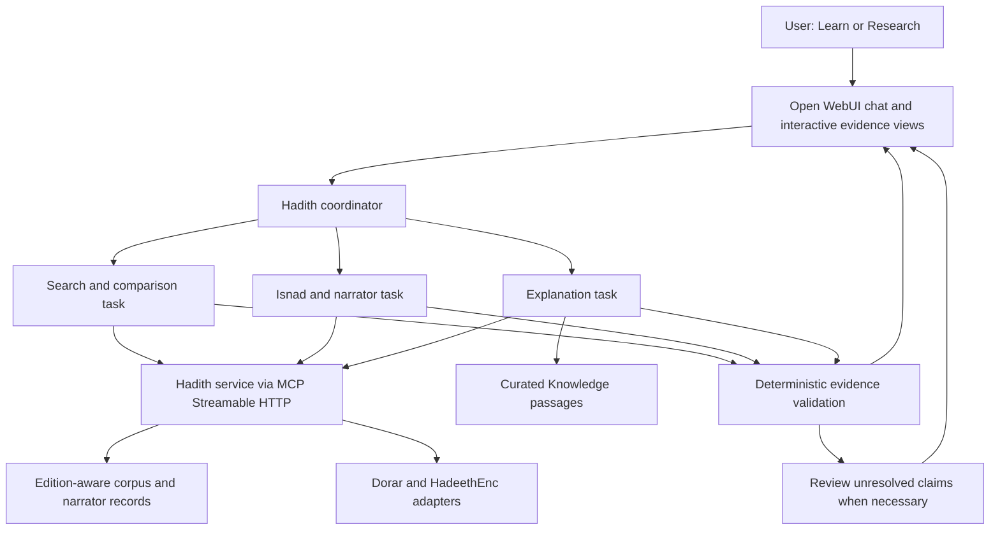

# Hadith knowledge assistant: product and architecture blueprint

Design review date: 4 October 2026. This is a proposed design, not a claim that the features below have been implemented or scientifically validated.

## 1. Product decision

Build a source-traceable Hadith assistant with two experiences: **Learn & Understand / تعلّم وافهم** and **Research & Compare / ابحث وقارن**. Both use the same evidence records. The difference is the amount of detail, terminology, and available research controls.

Primary hackathon user: an educator or person introducing Islam who needs to find, explain, and substantiate a Hadith. Specialist researchers are the second audience and provide the review workflow. General learners benefit from a simpler view of the same evidence.

Proposed product statement:

> منصة تساعد المعرّفين بالإسلام والباحثين على العثور على الحديث وفهمه، ومقارنة رواياته في الكتب الستة، واستكشاف أسانيده وتراجم رواته، مع عزو كل نص وحكم إلى مصدره وإظهار ما يحتاج إلى مراجعة.

The core promise is that a user can inspect the evidence behind an answer. An AI model retrieves, organizes, compares, and explains source material. Scholarly judgments retain their named authors and exact scope. The system does not establish a new Hadith grade by combining narrator labels.

## 2. Hackathon fit and scope

The supplied participant guide places this project in **Track 4: أدوات المعرفة والتحقق لتمكين المعرفين بالإسلام**. Interactive learning supports that track; it does not require changing the primary track.

The guide lists 4–6 October 2026 for development, with submission closing 6 October at 23:59 Saudi time. Later portal announcements, if any, have not been checked. The final product must work within its declared scope. The guide explicitly says a prototype alone is insufficient.

Required delivery:

- A functioning solution and a live link judges can use.
- Public GitHub repository containing code and files the team has the right to publish, setup instructions, dependencies, and source/tool/license records.
- Video of at most two minutes.
- PDF or PowerPoint presentation explaining the problem, solution, operation, added value, technology, results, and continuation plan.
- Documentation of religious/knowledge sources, how they are used, and how outputs are checked.

Prior work is permitted, but the guide says to disclose the starting version and rights; only work completed during 4–6 October is assessed. Preserve a dated baseline now, and distinguish existing code from new work. A snapshot taken now does not prove when earlier work was completed.

Final judging weights, distinct from application screening weights:

| Criterion | Weight | Evidence this product should show |
|---|---:|---|
| Technical quality and useful AI | 25% | Successful end-to-end tasks, error handling, comparison with simpler search |
| Benefit against the track objective | 20% | Faster evidence retrieval with measured citation and identification accuracy |
| Reliability and scientific safety | 15% | Attributed judgments, evidence links, unresolved cases, reviewer corrections |
| Innovation and added value | 15% | One connected workflow from wording to variants, chains, narrator sources, and explanation |
| User experience, communication, accessibility | 10% | Successful tasks by target users, Arabic RTL, readable terminology, keyboard access |
| Operational realism and continuation | 10% | Measured cost and latency, dependency fallback, ownership of content review |
| Presentation and inspectability | 5% | Reproducible demo and claims clearly separated from future features |

Guide references use physical PDF pages: Track 4 p.11; outputs p.14; scientific-source plan p.21; deadline p.27; readiness and repository pp.30–32; final presentation time p.35; final weights p.36; prior-work rule p.42. Printed page labels run one ahead of physical pages later in the file. Final judging is five minutes of presentation and three minutes of questions.

## 3. Analysis of the existing proposal and template

The 12-slide proposal already has the right central ingredients: a real research pain point, Track 4 alignment, precise attribution, cross-book retrieval, narrator identity resolution, and chain visualization.

Improve the proposal in these specific ways:

1. **Narrow the beneficiary.** Lead with an educator finding trustworthy evidence for an explanation. Present the advanced researcher as a second mode. The current proposal moves between every interested person, researchers, and specialists without one primary task.
2. **Measure the starting problem.** The story that one study takes a week is a useful interview observation. It is not yet a measured average. Compare the same tasks, stopping conditions, and accuracy requirements before claiming a reduction to minutes.
3. **Qualify narrator resolution.** The slide claiming proven identity disambiguation needs a labeled evaluation set and error examples. Use “candidate identification with evidence and reviewer confirmation” until demonstrated.
4. **Make uncertainty visible.** “All outputs have sources” is insufficient if a source concerns another wording or chain. Show which claim each passage supports and when matching is incomplete.
5. **Describe the technology actually used.** Fine-tuning appears in the proposal, but it is not required for this release and was not evidenced by the reviewed code. Prioritize indexed retrieval, evidence records, structured tool outputs, and evaluation.
6. **Compare against named alternatives.** Compare task completion using Dorar, a normal keyword search, and the new workflow. Compare fairly on the same corpus and task definition. The contribution is the connected evidence workflow and its measured quality, not the existence of a chat box.
7. **Replace unsupported slide notes.** Generic machine-learning references do not substantiate Hadith-specific claims. The arXiv quotation in the proposal notes needs its exact paper and passage verified before use.

The 31-slide attached template is a layout library. Slides 1–7 are instructions; slides 8–31 are layouts. It specifies Readex Pro, Arabic RTL, navy `#12183F`, violet `#6150EA`, turquoise `#2EF2C2`, and pale `#F2F4FF`. Its numerical examples are placeholders, not project results. The template itself does not set a slide count or presentation duration.

Suggested final narrative, around eight substantive slides for the five-minute slot: user/problem; current task; working solution; live evidence journey; trust method and limitations; measured comparison; technical/operating model; team and next delivery. Use the official template when preparing that deck; this review does not edit either presentation.

## 4. Source policy

The user supplied the relevant organizer instruction: check Hadith authenticity using Dorar's Hadith platform or approved editions of Sunnah books in Shamela, and never attribute a Hadith without a source. Apply this to every displayed quotation and judgment. The entire separate scientific package and its four content levels have not been supplied here, so full compliance with those levels remains to be checked.

Maintain a source register per edition and content type. An openly accessible dataset is a retrieval aid, not automatically an approved scholarly authority.

| Source | Proposed role | Important boundary |
|---|---|---|
| Dorar | Retrieve named scholarly judgments and takhrij, with a matching passage | A search result is not a new authenticity ruling; match its wording and scope |
| Approved editions in Shamela | Primary text, commentary, or narrator biography with edition and locator | Record exact work/edition/page or entry; platform name alone is insufficient |
| HadeethEnc | Attributed explanations, word meanings, benefits, and translations | Confirm acceptance for the intended content level; coverage and languages vary per entry |
| Itqan | Candidate local corpus, narrator aliases, retrieval and graph preparation | Derived mappings and grades require validation against authoritative sources |
| fawazahmed0/hadith-api | Additional text lookup, edition references, and cross-checks | A third-party project, distinct from Sunnah.com's official API; numbering needs explicit mapping |
| Sunnah.com official API | Optional separate provider | Its developer page describes API-key access and a portion of its data |

Source independence matters: agreement between two datasets that copied the same upstream source is not independent corroboration. Record upstream lineage.

For each displayed item, distinguish:

- Exact source quotation.
- A named scholar's assessment, including its target narration or chain.
- An AI summary of a cited explanation.
- An unresolved extraction, identity, or cross-source match.

Missing grading data means “not available in this source,” not automatically “مجهول” or “ضعيف.” Keep narrator reliability, narrator identity certainty, Hadith grade, and source-review status as separate fields.

## 5. Use cases for general users and educators

P0 means the proposed complete hackathon scope. P1 follows once P0 works and has evidence. P2 is later research/product expansion.

| ID | User request | Experience and result | Evidence/failure rule | Priority |
|---|---|---|---|---|
| L1 | “أتذكر كلمات من حديث…” | Ranked candidates, highlighted remembered words, collection references; choose one | Label exact wording, approximate wording, and related meaning separately | P0 |
| L2 | “ما الأحاديث المتعلقة بالرفق؟” | A few relevant narrations with one sentence explaining relevance | Retrieve first; show quoted text and attributed grade independently of relevance score | P0 |
| L3 | “هل هذا الكلام حديث؟” | Compare the supplied wording with retrieved texts and scholarly records | No hit means not found in searched sources, not fabricated | P0 |
| L4 | “اشرح هذا الحديث ببساطة” | Plain explanation, difficult words, practical meaning, source button | Explain the selected narration; do not invent occasion or historical background | P0 |
| L5 | “أريد شرحًا بالإنجليزية” | Arabic original alongside an attributed translation and explanation | Display language availability for that item; label machine translation separately if later enabled | P0, Arabic/English only |
| L6 | “أحتاج حديثًا لدرس عن حسن التعامل” | A short teaching card with text, source, explanation, and copy-with-citation | Preserve qualifications when copying; generated lesson applications are labeled | P1 |
| L7 | “لماذا اختلف الحكم بين هذين الموقعين؟” | Compare named judgments and the exact narrations they concern | Do not average grades or assume both assess the same chain | P1 |
| L8 | “هذان الحديثان يبدوان متعارضين” | Side-by-side texts, referenced commentary, and limits of available explanation | No improvised reconciliation or personal ruling; offer specialist review when needed | P1 |
| L9 | “أريد تعلم موضوع خطوة بخطوة” | Optional short learning path with vocabulary and reflection questions | User chooses interests and level; do not infer sensitive religious identity | P2 |
| L10 | “لدي صورة/تسجيل لحديث” | OCR/transcription preview, user corrects it, then ordinary verification | Extracted text is not itself evidence; uncertain words stay marked | P2 |

Learning mode should default to a small curated set of source-supported results. Research mode can expose all retrieval candidates, including weak, disputed, or ungraded records with clear attribution. Being contained in one of the six books is not a uniform grade label for every returned item.

## 6. Use cases for specialists

The six-book scope is Bukhari, Muslim, Abu Dawud, Tirmidhi, al-Nasa'i (specify the chosen Sunan edition/collection), and Ibn Majah. Other collections must be an explicit scope extension.

| ID | Specialist task | Required result | Critical distinction | Priority |
|---|---|---|---|---|
| R1 | Find occurrences of a selected narration in the six books | Per-book evidence list with edition-aware references | “Not found in indexed edition” is not “absent from all editions” | P0 |
| R2 | Compare variant matn wordings | Aligned passages, additions/omissions highlighted, original text preserved | Exact duplicate, same report with variant wording, and topical similarity are separate relations | P0 |
| R3 | Draw chains for the selected report across collections | Ordered, occurrence-specific paths and a merged graph with source-backed edges | A general teacher/student network does not prove the chain of this Hadith | P0 for a declared reviewed set |
| R4 | Inspect a narrator | Full name, aliases, kunya, dates, places, teachers/students, attributed criticism | Keep differing assessments and uncertain biographical dates | P0 for graph narrators |
| R5 | Resolve “سفيان” or another ambiguous name | Ranked identities, surrounding-chain evidence, source locators, unresolved option | Do not favor a candidate because the candidate is ثقة | P0: display uncertainty; advanced resolution P1 |
| R6 | Compare jarh and ta'dil statements | Scholar/work/passage comparison, context and qualifications | Do not reduce all statements to one unconditional badge | P1 |
| R7 | Inspect chronology and possible discontinuity | Dates, locations, evidence of relation, and research flags | Chronological compatibility alone does not prove meeting or transmission | P1 |
| R8 | Explore related routes, mutaba'at and shawahid | Candidate route relationships with rationale and review state | “Related” is a retrieval suggestion until scholarly classification is supported | P1 |
| R9 | Build a research dossier | Export selected texts, paths, narrator passages, judgments, and unresolved questions | Export a reviewable evidence dossier, not a claimed finished scholarly verdict | P1 |
| R10 | Correct an entity or path | Reviewer identity, reason, supporting source, versioned change record | A correction changes reviewed records; it does not silently rewrite historical evidence | P1 |

## 7. Flagship user journey

1. User enters a remembered phrase, in Arabic or English.
2. Search returns candidates with match type and provenance. The user selects the intended narration when ambiguous.
3. The selected narration card shows Arabic text, collection/chapter, edition/numbering, and source-supported judgment where available.
4. “Compare in the six books / قارن في الكتب الستة” opens a six-collection coverage panel. Each collection has explicit states: found, no match in the indexed corpus, not indexed, or retrieval unavailable.
5. A wording comparator separates the same-report candidates from merely relevant Hadiths.
6. “Explore the isnad / استكشف الإسناد” opens occurrence-specific paths. A user can display one collection, selected paths, or the combined graph.
7. Selecting a narrator opens identity evidence, biographical details, and cited assessments.
8. “Explain / اشرح” shows a sourced accessible explanation of the selected wording.
9. “Copy with sources / انسخ مع المصادر” copies the quotation and citation together.

The selected occurrence IDs and source version remain stable through every step. The model must not silently switch to a different Hadith when fetching a more convenient explanation.

## 8. Interactive components

| Component | Interaction | Value | Delivery route |
|---|---|---|---|
| Evidence card | Expand text, source passage, or explanation; copy with citation | Answers remain readable while their basis is inspectable | P0: Markdown plus Actions or a trusted Rich UI template |
| Six-book coverage panel | Select collection and occurrence | Makes scope and missing coverage visible | P0: Rich UI; simple table fallback |
| Matn comparator | Select two narrations; highlight additions and omissions | Shows why variants are related and where they differ | P0: structured diff rendered in Rich UI |
| Isnad explorer | Select route; expand shared segment; open narrator | Connects narration and people | P0: Mermaid export; Rich UI node selection for reviewed records |
| Narrator detail drawer | Switch biography, identity evidence, and scholarly statements | Avoids overwhelming the main graph | P0 for a bounded set; general expansion P1 |
| Evidence status controls | Show reviewed, ambiguous, or incomplete items | Helps specialists find the parts needing work | P0: labels; filtering P1 |
| Explanation lenses | Beginner explanation, vocabulary, source commentary | Adapts presentation to knowledge level | P0: basic explanation; additional lenses P1 |
| Related-Hadith map | Select a relation and inspect why it was suggested | Useful discovery with transparent relevance | P1; semantic similarity is never an authenticity score |
| Timeline of narrators | Select an individual or route and inspect dates | Supports research questions about possible meetings | P1; incomplete/uncertain dates remain explicit |
| Research tray | Save selected occurrences and export an evidence bundle | Reduces repeated searching across a study | P1 |
| Reviewer correction panel | Propose identity/path change with a source | Builds a maintained research asset | P1 |
| Guided learning cards | Choose the next topic or answer a short comprehension prompt | Makes a sustained learning journey possible | P2 |

The highest-value visual is a graph synchronized with the wording comparator and evidence panel: selecting a route highlights its particular text; selecting a narrator highlights that occurrence's chain segment and sources.

Keep the live graph compact by default. Node label: full name, one clearly attributed assessment or “multiple assessments,” death year if available, and identity-review state. Expanded node mode can include kunya and city. Long biographies and quotations belong in the drawer. An exported expanded Mermaid view can include these details within nodes, while a separate evidence table preserves full citations.

Never rely on color alone. Supply labels and a text/table equivalent. Support RTL and mixed Arabic/English citations, keyboard selection, small screens, and sensible reading order.

## 9. Isnad graph model and safeguards

The internal object is a graph of occurrence-specific ordered paths. “Tree” is a familiar UI name, but merged chains can branch and reconverge.

For each occurrence, retain the original Arabic text, extracted sanad span, ordered narrator mentions, transmission phrases, narrator-identity candidates, and source coordinates. Support multiple chains within an occurrence, chain switches such as ح, and endpoints that the source actually supports. Do not always append the Prophet or designate the final extracted person a Companion.

The renderer must not merge edges merely because two narrators share a general teacher/student relationship. Each displayed edge needs an occurrence/path membership and evidence span. When shared nodes are merged, route selection must preserve valid paths and avoid fabricating new end-to-end combinations.

Suggested states:

- Source-extracted, not yet reviewed.
- Identity ambiguous.
- Path reviewed against source.
- Source unavailable or insufficient.

Arrow legend: compiler/recipient **روى عن** source/teacher, when displaying source-reading order. If a chronology view reverses the visual direction, change the arrow legend explicitly.

Mermaid is a rendering/export format, not the evidence store. Generate Mermaid deterministically from validated graph JSON. Escape labels, control link destinations, and preserve a text fallback. A missing source must yield a visible partial graph or unresolved segment, not an invented node.

Illustrative schema only, with no actual Hadith assertion:

```json
{
  "family_id": "reviewed-family-id",
  "occurrence_ids": ["provider:edition:collection:chapter:entry"],
  "paths": [{"path_id": "p1", "occurrence_id": "...", "node_ids": ["n1", "n2"]}],
  "nodes": [{
    "node_id": "n1",
    "mention_text": "source wording",
    "narrator_id": null,
    "identity_status": "ambiguous",
    "candidate_ids": ["candidate-a", "candidate-b"],
    "assessments": []
  }],
  "edges": [{
    "from": "n1", "to": "n2", "path_ids": ["p1"],
    "transmission_phrase": "source wording",
    "evidence_ids": ["e1"]
  }],
  "coverage": {"searched_collections": [], "missing_collections": []},
  "review_status": "needs_review",
  "evidence": [{"id": "e1", "source_record_id": "...", "text_span": [0, 20]}]
}
```

## 10. Open WebUI architecture

The local checkout reports version **0.11.4**. The running deployment and settings were not inspected. Confirm that the server uses this checkout/version before applying the following configuration.



### Agents and subagents

Use two public Workspace model presets: Learning Guide and Research Assistant. Each defines audience, response style, source policy, permitted tool set, and Knowledge collections. They can initially share a capable Arabic tool-calling base model; select the model based on measured performance in this corpus.

Keep one coordinator in each conversation. It identifies the task, preserves selected record IDs, requests the necessary tools, and combines results. Simple lookups need no subagent.

| Logical role | Inputs | Outputs | Boundary |
|---|---|---|---|
| Search and comparison | Query, collection scope, selected occurrence | Ranked candidates, variant relations, coverage | No authenticity inference from ranking |
| Isnad and rijal | Occurrence IDs, verified source text | Paths, entity candidates, cited profiles | No inferred edges or grade-based identity selection |
| Explanation | Selected occurrence and approved commentary IDs | Accessible explanation with passage citations | No invented context or personalized ruling |
| Evidence reviewer | Claim/evidence manifest | Unsupported claims, wrong-record matches, unresolved issues | Does not replace deterministic checks or a human scholarly reviewer |

Open WebUI's built-in `delegate_task` starts focused tasks with the parent model and inherited capabilities. These role descriptions are task assignments, not automatically isolated specialist models. It does not recursively spawn more subagents. Foreground subagents inherit external MCP/OpenAPI tool servers; background subagents do not. Enable native tool calling and subagents at the relevant global/model settings, and use foreground delegation for MCP-dependent work. Start with small explicit concurrency/iteration limits.

If different specialist models or enforced tool boundaries become necessary, implement an explicit orchestrator or dedicated service endpoints. Do not assume the native delegation tool provides those boundaries. For the first release, one coordinator plus deterministic tools may outperform a larger agent arrangement in latency and cost.

### MCP, Tools, Functions, and Knowledge

**MCP:** one external Hadith service provides structured search, text, path, narrator, and source operations. It owns provider adapters and domain data. Native transport is Streamable HTTP. An SSE/stdio-only server requires a compatible translation proxy; the integration guide's direct SSE example should be replaced. MCP is the connection protocol, not an authentication authority or a knowledge base.

**Tools:** retain the current Python tool as a thin adapter during migration. Expose a small tool surface; avoid duplicate competing implementations for the same operation. Return JSON records and evidence IDs, not only prose.

**Functions:** an Action can open a comparison or export a chosen result. A Filter can enforce response checks, but core citation and record checks belong in deterministic service code and should also apply to direct tool responses.

**Knowledge:** use curated commentary, terminology, and educational explanations for passage retrieval. Store exact texts and chains in structured records. An embedding index retrieves candidates; it does not establish identity, chain order, or a grade. Do not put the entire narrator graph into a document collection and expect RAG to reconstruct it reliably.

### Proposed tool contract

| Operation | Main input | Main output |
|---|---|---|
| `search_hadith` | Query, exact/fuzzy/topic mode, six-book scope, language | Ranked occurrence IDs, match type, snippets, coverage |
| `get_hadith` | Stable occurrence ID | Full exact text, edition/numbering metadata, citations |
| `find_variants` | Occurrence ID, target collections | Candidate related occurrences, relation type, rationale, review status |
| `get_isnad_graph` | Selected occurrence IDs, reviewed-only option | Nodes, ordered paths, evidence-backed edges, missing data |
| `get_narrator` | Stable narrator ID | Biographical facts and distinct attributed assessments |
| `resolve_narrator_mention` | Text span plus surrounding path | Candidate identities and evidence; unresolved permitted |
| `get_scholar_judgments` | Matched occurrence/text | Attributed judgment records and exact scope |
| `get_explanation` | Verified Hadith/explanation mapping, language | Source explanation, word meanings, benefits, availability |
| `get_source_passage` | Evidence ID | Inspectable source excerpt and locator |
| `export_evidence_bundle` | Selected IDs and format | Text/citations/graph export plus review-state manifest |

Common envelope: `status`, `data`, `evidence`, `coverage`, `warnings`, `dataset_version`, and `retrieved_at`. Distinguish `no_match`, `ambiguous`, `provider_unavailable`, and `invalid_reference`. A provider error must never become a theological conclusion.

### Data records

Use a separate domain database from Open WebUI's internal application database. SQLite plus suitable text indexing is adequate for a bounded release; a graph database is optional, not a prerequisite.

Required entities:

- Source provider, edition, numbering scheme, collection, book/chapter, entry, original text, and upstream lineage.
- Hadith occurrence, reviewed report-family relation, variant relation, and exact retrieval references.
- Chain/path, narrator mention with text offsets, resolved narrator identity, and alias.
- Narrator assessment as a distinct scholar/work/quotation/locator record.
- Hadith judgment as a distinct record with its precise target and qualifications.
- Explanation and translation with source and explicit cross-corpus mapping.
- Evidence passages, import versions/hashes, reviewer decisions, and correction history.

A candidate occurrence key is `provider + edition + collection + chapter + entry`. Validate uniqueness and source semantics; neither the current `hadith_id` nor `id_in_book` alone should be assumed universal. Keep display numbering separate from internal IDs. Model suffixes, repeated occurrences, and one-to-many crosswalks explicitly.

Preserve original Arabic unchanged. Normalized search text, tokens, and embeddings are separate derived fields. Retrieve exact/normalized phrase matches first, then fuzzy candidates and semantic matches, with the match category visible. Limit retrieval to the chosen collection set, rank results, and paginate. Do not interpret the first SQL rows as the “most relevant.”

## 11. Trust and validation workflow

1. Import approved, versioned source records and preserve originals.
2. Retrieve candidates and identify the selected occurrence.
3. Match external judgment/explanation records to that occurrence or mark the mapping unresolved.
4. Extract/assemble paths and narrator candidates with evidence spans.
5. Run deterministic checks: identifiers exist; citations resolve; source quotations match; graph edges belong to an occurrence; selected scope is respected.
6. Generate the user explanation from the validated evidence package.
7. Check that each substantive attribution has supporting evidence. Render unsupported parts as unavailable or pending review.
8. Use human review for ambiguous identity, consequential interpretation, and scholarly conclusions not established by the sources.

Do not claim that a second LLM removes hallucination. Evaluate its review contribution independently. Prompt instructions alone are insufficient for exact text, graph edges, or citation validity.

Interactive views should use reviewed templates with escaped source text. Keep provider credentials server-side, use bounded read-only operations for public users, and retain ordinary iframe isolation. Rich UI selection should not require enabling arbitrary access to Open WebUI's parent page.

## 12. Complete release scope for the hackathon

Build the following functioning scope first:

1. Search the explicitly indexed six-book corpus with edition-aware references and honest coverage.
2. Select an occurrence and inspect its full text and source.
3. Explain supported selected narrations in Arabic and English using attributed HadeethEnc records.
4. Compare text variants and draw reviewed paths for a **declared initial set of report families**, with explicit unsupported states outside that set.
5. Inspect narrator details and evidence for that set.
6. Copy/export text with citations, run evaluation, and publish the documented working application.

A suggested initial target is ten reviewed report families, with multiple occurrences where available. This is a scope proposal, not existing coverage and not a promise that each family occurs in all six collections. Prefer a smaller functioning set with honest boundaries over unvalidated full-coverage claims. The broader search and the reviewed graph set must be labeled separately.

Sequence:

| Day | Focus | Acceptance condition |
|---|---|---|
| Oct 4 | Source/ID corrections, freeze scope, review starting baseline, define evaluation set | Selected record references are unambiguous; unsafe chain assumptions removed before display |
| Oct 5 | Search-to-comparison journey, reviewed graphs, explanation cards | User can complete the supported journey, including missing-data cases |
| Oct 6 | Repeated evaluation, user tasks, deployment, documentation, video and pitch | Judge can reproduce the documented cases from the live link and repository |

Exclude from this release: whole-corpus automatic final grading, unrestricted narrator identity resolution, autonomous fatwa, training a new language model, OCR/audio ingestion, and large multilingual learning paths. Revisit these after the core evidence workflow is measured.

## 13. Evaluation and demo

Prepare a held-out test set with a qualified Hadith reviewer. Suggested starting size: 40 cases, separate from demonstration examples: phrase search 8; thematic retrieval 6; identity/citation lookup 6; wording/chain comparisons 6; narrator ambiguity 6; explanation support 4; no-match/conflict/provider failure 4. Ensure six-book coverage and relevant chain structures where supported. Numbers here are test-plan targets, not measured performance.

Report:

- Search Recall@5 and ranked relevance against reviewer labels.
- Exact source attribution and reference-resolution accuracy.
- Narrator identity precision, plus unresolved rate and coverage. A resolver can look accurate simply by refusing almost everything, so report both.
- Ordered-path and edge correctness against reviewed source spans.
- Whether explanations are supported by their cited passages.
- Correct handling of no match, ambiguity, missing data, conflicts, and provider failures.
- Task time, completion, and source comprehension for educators and specialists separately.
- Median/p95 latency, per-task model cost, and number of model/tool calls.

Any invented quotation, unsupported graph edge displayed as verified, or wrong citation presented as established is a release-blocking error in the evaluation set. Zero observed errors in a small set is not proof of zero errors generally. State denominators and limitations.

Compare keyword-only retrieval with the proposed retrieval pipeline. Compare manual research with the assistant on identical tasks. Repeat selected stochastic tasks and keep model, prompt, dataset, and source versions.

Two-minute demo proposal: enter remembered words; choose the intended text; open six-book comparison; select an isnad route and narrator source; display a plain explanation; show one unresolved case handled correctly; copy the cited result. Demonstrate one complete task before introducing secondary features.

## 14. Reference material

- [Participant guide, supplied official URL](https://islamicaich.org/files/HackathonFile/da2OrbRMEsNrIQaoq8z6jEv26opKXdQmq1i0XfXo.pdf).
- [HadeethEnc API documentation, supplied by the user](https://hadeethenc.com/api-docs/). The landing page was retrieved; its detailed interactive Postman spec was not extracted. Actual endpoints were probed separately.
- [HadeethEnc languages](https://hadeethenc.com/api/v1/languages).
- [Dorar Hadith platform](https://dorar.net/hadith).
- [Shamela](https://shamela.ws/).
- [Itqan repository](https://github.com/R3GENESI5/Itqan), also inspected locally.
- [Third-party Hadith API repository](https://github.com/fawazahmed0/hadith-api).
- [Sunnah.com developer information](https://sunnah.com/developers).
- [Open WebUI extensibility and transport](https://docs.openwebui.com/features/extensibility/).
- [Open WebUI subagents](https://docs.openwebui.com/features/chat-conversations/chat-features/subagents/).
- [Open WebUI Rich UI](https://docs.openwebui.com/features/extensibility/plugin/development/rich-ui/).
- [Open WebUI Mermaid](https://docs.openwebui.com/features/chat-conversations/chat-features/code-execution/mermaid/).

Local inputs: both supplied Markdown files, the 12-slide proposal, the 31-slide template, current Python tool, database builder, local database, local Itqan source files, and relevant local Open WebUI code. Companion document `source_and_implementation_review.md` records the concrete defects and probe results. No existing implementation or source presentation was modified during this design review.
