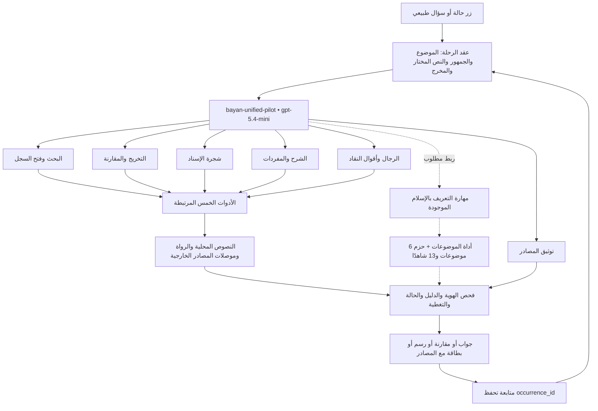

# مراجعة المساعد الموحد والمهارات الست

6 أكتوبر 2026. مراجعة ملفات التصدير والكود المحلي، مع تأكيد وجود النموذج في محرر Open WebUI الحي. ليست هذه نتيجة قبول لمحادثات النموذج الموحد. ملف البصمات: [unified_six_skills_audit_2026-10-06.json](unified_six_skills_audit_2026-10-06.json).

## القرار

البنية مناسبة لتوحيد تجربة المستفيد، لكنها لا تزال نسخة تجريبية تحتاج تصحيح الموجه وربط مسار التعريف بالإسلام قبل اعتمادها وجهةً عامة للأزرار. لا نحتاج إنشاء أحد عشر ملف مهارة الآن. نحتفظ بالنواة الست الحالية، ونفعّل مهارة التعريف الموجودة عند تشغيل هذا المسار، ونجعل البطاقة صيغة ناتج داخلها.

## الموجود فعليًا

- ثمانية إعدادات نماذج في التصدير، بينها `bayan-unified-pilot`، جميعها تعتمد `gpt-5.4-mini`. هذه إعدادات وأدوار فوق نموذج أساسي، وليست ثمانية نماذج دُرّبت.
- سبع مهارات نشطة في الكتالوج. ست منها مربوطة صراحةً بالنسخة الموحدة عبر `meta.skillIds`.
- خمس مجموعات أدوات مربوطة بالنسخة الموحدة: corpus_search، takhrij، sharh_vocab، narrator، isnad_tree.
- `hadith-islam-guide` موجودة كمهارة لكنها غير مربوطة صراحةً بالنسخة الموحدة. يوجد أيضًا نموذج مستقل يحمل المعرف نفسه، ويرتبط في التصدير بأداة corpus_search فقط؛ يجب تمييز معرف النموذج عن معرف المهارة.
- `hadith_bayan_topics` غير موجودة في قائمة أدوات النسخة الموحدة، و`knowledge: null`. واجهة Workspace الحية أظهرت Models 8 وSkills 7 وTools 7 وKnowledge 0. عدد الأدوات في الكتالوج لا يثبت ربطها بالنموذج.
- تعليمات المساعد مكررة داخل system prompt والمهارات، وتفرض تقريرًا بحثيًا من سبعة أقسام على كل طلب.

| المهارة المرتبطة | الوظيفة المقصودة | التعديل المطلوب |
|---|---|---|
| `hadith-search-record` | البحث وفتح السجل | إعطاء occurrence_id الأولوية، وإظهار حدود النتائج وحالة الالتباس |
| `hadith-takhrij-compare` | مقارنة المواضع والألفاظ | فصل الوقائع، وإسناد كل سطر إلى سجل مفتوح وحكم منسوب |
| `hadith-mermaid-architect` | عرض الإسناد | الرسم من JSON مثبت، مع حفظ المنتهى الحقيقي والفجوات والمرشحين |
| `hadith-sharh-scholar` | الشرح والمفردات والفوائد | عدم فرض خمسة فوائد أو ترجمة أو عزو لكتاب لم يرجع من المصدر |
| `hadith-rijal-critic` | التراجم وأقوال النقاد | الفصل بين الرواة المرشحين والأقوال، وعدم فرض سلسلة تنتهي بالنبي ﷺ |
| `hadith-source-provenance` | عرض المصادر | مواءمة الحقول الفعلية وحالة البيانات الناقصة دون اختلاق بيانات طبعة |

## الملاحظات التي تسبق تحويل الأزرار

| المعرف | الأولوية | الدليل والمشكلة | المطلوب ومعيار القبول |
|---|---|---|---|
| U01 | P0 | الموجه ومهارة Mermaid يفرضان قمة نبوية وحظر النهايات الجزئية، ويطلبان مرور التابعي حتمًا بصحابي. هذا يتعارض مع عقد الأداة الذي يحفظ الموقوف والمقطوع والمرسل والفجوات. | لا تغيّر عقدة أو وصلة لإكمال الشكل. اختبر حالات المنتهى الأربعة و«عن أبيه» المجهول ومسارًا جزئيًا. إذا عُرض الإرسال فلا يُرسم كسماع مباشر مؤكد ولا يُخترع له صحابي. |
| U02 | P0 | مهارة التوثيق والموجه يطلبان `raw_explanation_text`، بينما الكود الحالي يعيد `data.explanation`. `reference` قد يكون null ولا يضمن بيانات ناشر وطبعة مكتملة. | استعمل الحقول الفعلية أو أضف alias موثقًا في العقد. أظهر غير متاح عند نقصها، وانسب مادة HadeethEnc كما رجعت؛ لا تسمّها اقتباسًا حرفيًا من فتح الباري بلا دليل. |
| U03 | P0 | الموجه يوصي بالرقم والباب بدل إعطاء المعرف الثابت الأولوية، ويقول إن limit=20 يضمن استيعاب جميع الكتب. | افتح occurrence_id نفسه قبل الشرح والرسم. لا ترجع للرقم عند معرف غير صالح. حد النتائج ليس إثبات استقصاء؛ نفّذ بحثًا لكل كتاب/صفحات حسب دعم الأداة، واذكر حدود التغطية. |
| U04 | P0 | المسار التعريفي غير مربوط بمهارته وحزمه، والواجهة ما زالت تعتمد `chapter_title_candidate_only`. مثال: قائمة الإيمان تتضمن الأيمان والنذور التي استبعدتها حزمة الدرس. | اجعل taxonomy والحزم مصدر المعنى؛ مرّر topic_id والجمهور والصيغة إلى أداة الموضوعات. احتفظ بحالة needs_review. |
| U05 | P1 | سكريبت النشر يقول إنه يحافظ على النماذج السابقة لكنه يغيّر مهارات مشتركة، ويحدّث `meta.skillIds` للمنسقين القديمين في الأسطر 435–444. | صدّر snapshot سابقًا وقارن قبل/بعد. اجعل التحديث مقصورًا على النسخة التجريبية أو استعمل معرفات مهارات ذات إصدارات. استخدم الاستيراد المدعوم؛ لا تُعد تشغيل تحديث SQL المباشر بلا خطة إصدار. |
| U06 | P1 | القالب يفرض شجرة وأسانيد وشرحًا وترجمة لكل سؤال. | موجه قصير يختار المهارة وشكل الناتج حسب الطلب. سؤال تعريفي قصير يعيد جوابًا قصيرًا وأدلته، والتوسع اختياري. |
| U07 | P1 | توحيد العقد يُعلّل بعرض 650px؛ المثال يلوّن رواة افتراضيين بفئة reliable. | الدمج بهوية محلولة موثقة، لا بتشابه الاسم أو لتضييق الرسم. اللون يدل على حالة مثبتة فقط. شبكات رواة الكتاب تُميّز عن طرق متن واحد. |
| U08 | P1 | مثال التوثيق يتضمن HadeethEnc 5214 وبيانات طبعات نموذجية؛ قد تنتقل إلى الإجابة بلا استرجاع. | استبدل القيم الثابتة بمتغيرات واضحة، واختبر ألا تظهر في جواب لا يحتوي دليله هذه القيم. |

عبارة أن كتابة عدة أسهم في سطر واحد «تدمر التخطيط» ليست شرط صحة نعتمده. يمكن إبقاء سهم لكل سطر كقاعدة تنسيق. الدليل وهندسة المسارات هما معيار القبول.

## تحميل المهارات: ما يثبته الكود

في `open-webui/backend/open_webui/utils/middleware.py`، يجمع التطبيق skill_ids المرسلة وmeta.skillIds والإشارات داخل الرسائل. مع Builtin Tools، يعرض الكتالوج المتاح للمستخدم وقد يسمح بتحميل مهارات أخرى؛ لذا لا تعمل الستة كقائمة منع حصرية. المهارة المذكورة صراحةً تُحمّل تعليماتها، والبقية تُتاح عبر `view_skill` بحسب الإعدادات.

الكود في `utils/skills.py` يتعرف على صيغة `<$skill-id|label>`. لا نفترض أن إضافة `skill=` إلى URL تُفعّل مهارة. يلزم اختبار استلام المهارة في طلب المحادثة أو trace التحميل. الكود المفحوص نسخة مساحة العمل؛ يثبت Agent 4 تطابق السلوك مع النسخة المثبتة.

كذلك لا يثبت تفعيل مربع Sub-agents تنفيذ تفويض فعلي. تُنسب هذه القدرة للتشغيل بعد إظهار trace، ولا توصف كبوابة تحقق علمي مستقلة.

## مخطط البنية الفعلية والربط التالي

الخط المتقطع يعني ربطًا مطلوبًا. فحص الدليل هنا مطلب معماري يجمع التحقق البرمجي والمراجعة؛ ليس ادعاء بوجود بوابة تنفيذية مكتملة لكل مخرج. لا تُعد مهارة التوثيق وحدها مانعًا برمجيًا للهلوسة.

## حالة تقارير الوكلاء

آخر تقرير Agent 1 المتاح: `agent_1_round2_delivery_report.md`. تقريرا Agent 3 المتاحان لا يغطيان النسخة الموحدة الجديدة. لم يظهر تقرير أحدث مستقل لـ Agent 2 أو تقرير قبول للمهارات الست؛ السكريبت والتصدير هما التحديث الجديد المرصود.

التحقق السابق في هذه المراجعة أعاد إنتاج تطابق 13/13 شاهدًا، و12/12 لاختبارات الموضوعات، و6/7 لاختبارات backend مع تعذر حالة الشرح المطابق. بعض ملاحظات QA القديمة أُصلحت في الكود؛ تبقى حالات الاسم الفارغ ومواءمة النسخة المنصبة والقبول الحي للمخرجات مطلوبة كما في [خطة الوكلاء](agent_next_steps_2026-10-06.md). هذه أرقام تشغيلات محددة وليست شهادة للنسخة الموحدة.

## توزيع العمل التالي

- **Agent 1:** U02 وU03 وU04 وU06، وربط المفاهيم والموضوعات والأزرار حسب [التكليف التفصيلي](agent_1_unified_journey_task_AR.md). يمكنه تنسيق تصحيح المهارات في ملفات تصدير محلية دون تغيير إعدادات المستخدم الحية.
- **Agent 2:** U01 وU07، وفحص كل عقدة ووصلة مقابل paths/source_span وحفظ الحالات غير المحلولة.
- **Agent 3:** قبول النسخة المصححة ببصماتها، مع اختبار الحمل الفعلي للمهارة والأداة وهوية النص من الزر إلى الناتج.
- **Agent 4:** U05، الاستيراد والمزامنة والرجوع، ربط أداة الموضوعات ومعرف Knowledge الحقيقي عند استيرادها، وإثبات trace التشغيل.
- **Codex:** العرض ومواصفات الرسوم ومراجعة التكامل. تبقى الوجهات المتخصصة الحالية فعالة إلى أن ينجح قبول المسار الموحد.

لا حاجة لإضافة وكلاء جدد لهذه الدورة. يمكن فصل صياغة المهارات إلى Agent 5 فقط إذا كانت سعة Agent 1 لا تكفي.
