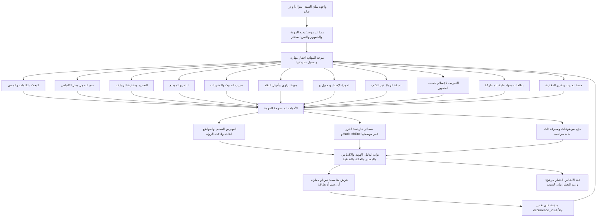
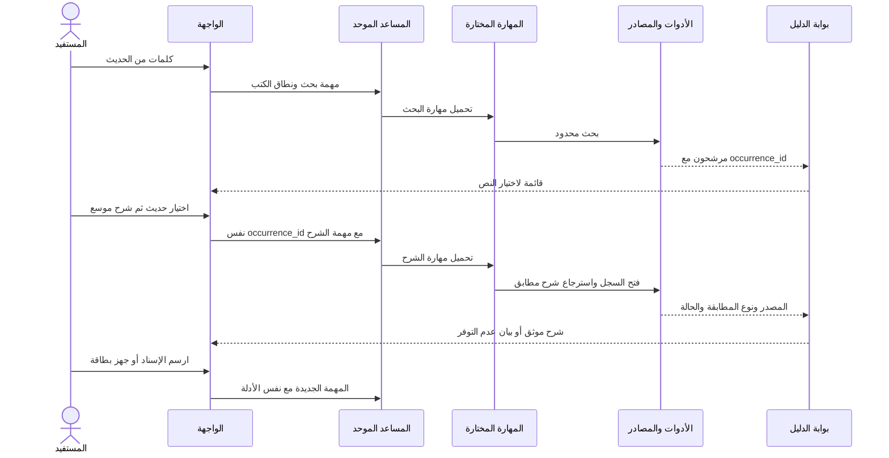

# بيان السُّنّة — مساعد واحد ومهارات متخصصة

قرار معماري مقترح، 6 أكتوبر 2026. الجرد الأول: `current_models_skills_audit.json`. هذه الوثيقة تصف خط الأساس وخيارات التوسع؛ لا تعني أن المهارات المقترحة نُشرت.

**تحديث بعد إنشاء النسخة الموحدة:** ظهر `bayan-unified-pilot` بست مهارات مرتبطة ضمن كتالوج من سبع مهارات. المراجعة الأحدث وحالة التنفيذ في [unified_six_skills_review_AR.md](unified_six_skills_review_AR.md). العدد 11 أدناه تفصيل وظيفي سابق للتوسع، وليس عددًا يجب إنشاؤه الآن. نعتمد النواة الست مع إعادة استخدام مهارة التعريف الموجودة وقالب البطاقات داخلها. الأوصاف «جديدة/مثبتة» أدناه تعود إلى الجرد الأول.

## القرار

نعتمد مساعدًا ظاهرًا واحدًا للمستفيد في المرحلة التالية، مع مهارات تُحمّل حسب المهمة، وأدوات تسترجع الدليل وتعيد بيانات قابلة للفحص. نحافظ على إعدادات النماذج الحالية كخط أساس واختبارات مقارنة إلى أن تجتاز النسخة الموحدة القبول. لا نحتاج تدريب نموذج جديد أو سبعة نماذج أساسية: الإعدادات السبعة الحالية تستخدم `gpt-5.4-mini`، والاختلاف في التعليمات والأدوات والمهارات.

الخطوة الأولى توحيد سياسة الدليل وتوجيه المهمة، ثم تحسين اختيار المهارات. جمع جميع التعليمات القديمة في موجه طويل سيُبقي تعارضاتها.

## ما وجدناه في النماذج الفعلية

| الإعداد | دوره الحالي | ما ينتقل إلى المهارات | ملاحظة المراجعة |
|---|---|---|---|
| `hadith-model-1` | منسق البحث والتخريج والشرح والرسم | تنسيق المهمة وسياسة الاسترجاع | موجهه مطابق للنموذج التالي؛ أربع مهارات مربوطة فعليًا |
| `hadith-modular-agent` | المنسق نفسه، ومدخل حالة الحج عرفة | نسخة تجريبية مرشحة للتوحيد | أضفنا ربط أداة الإسناد عبر محرر Open WebUI إلى النموذجين؛ يلزم تحديث نسخة الأداة نفسها |
| `hadith-phrase-poc` | كلمات متذكّرة ← اختيار ← فتح سجل | البحث والفتح الدقيق | نطاق ضيق مفيد للاختبار؛ لا يحكم على الصحة |
| `hadith-rijal-agent` | التراجم، أقوال النقاد، شبكة الكتاب | هوية الراوي وشبكته | تعليماته تحتاج إزالة فرض اتصال السند وفرض منتهى نبوي |
| `hadith-islam-guide` | مادة تعريفية أولية حسب الموضوع | التعريف بالإسلام والبطاقات | أداة البحث فقط؛ أداة الموضوعات وKnowledge لم تُربطا بعد |
| `hadith-mermaid-agent` | عرض الأسانيد في Mermaid | عرض الرسم من بيانات موثقة | أداة الإسناد موجودة؛ تعليمات «كل مسار مكتمل» تحتاج تصحيحًا |
| `hadith-sharh-agent` | شرح ومفردات وفوائد | الشرح الموسع والمفردات | لا تُطلب نسبة إلى كتاب محدد أو ترجمة معتمدة إذا لم ترجعها الأداة |

هناك أربع مهارات نشطة مثبتة: `hadith-mermaid-architect`، `hadith-sharh-scholar`، `hadith-rijal-critic`، `hadith-islam-guide`. ربطها موجود في `meta.skillIds` للمنسقين، مع native function calling وBuiltin Tools. إعداد function_calling غير مصرح به في نموذجي Mermaid والشرح؛ يجب اختبار الوضع الفعلي الموروث قبل استنتاج أنه معطل.

فحص كود النسخة المثبتة يثبت وجود `view_skill` ومعالجة `skillIds`. توثيق [Open WebUI Skills](https://docs.openwebui.com/features/workspace/skills/) يشرح تحميل التعليمات عند الطلب. المهارة تعليمات؛ لا تُضيف تلقائيًا أداة مفقودة أو معرفة غير مستوردة. وجود `delegate_task` في الموجه ليس دليلًا على أنه نُفذ؛ يلزم تتبع فعلي لإثبات التفويض.

## مخطط المهارات الكامل المقترح



الترتيب أعلاه معماري، وليس إثباتًا لتشغيل المهارات الإحدى عشرة. بوابة الدليل مكون برمجي مشترك، وليست تصويتًا بين نماذج لغوية على صحة الحديث.

## سجل المهارات وحدودها

| معرف المهارة | الحالة | المدخل والأداة | المخرج وحد القبول |
|---|---|---|---|
| `hadith-search` | جديدة | عبارة + نطاق؛ `search_hadith_corpus` أو `search_remembered_hadith` | مرشحون بمعرفات ثابتة، بلا ادعاء استيعاب جميع الكتب |
| `hadith-exact-record` | جديدة | occurrence_id؛ `open_hadith_record` أو الفتح الدقيق في أداة corpus | نفس النص والباب والبصمة؛ الرقم المجرد يحتاج استيضاحًا |
| `hadith-takhrij-compare` | جديدة | معرفات المواضع + الكتب؛ corpus وtakhrij | مقارنة الألفاظ ومراجع الأحكام، مع تمييز التكرار عن الطريق المستقل |
| `hadith-sharh-scholar` | مثبتة وتحتاج تنقيحًا | نص مختار + occurrence_id + لغة؛ `get_hadith_explanation` | نص الشرح المسترجع ومصدره ونوع المطابقة؛ unavailable عند غياب المطابق |
| `hadith-vocabulary` | فصل جديد من مهارة الشرح | اللفظ وسياقه؛ `lookup_gharib_word` و`lookup_root_lexicon` | معنى مسند؛ لا اشتقاق أو إحالة تراثية مخترعة |
| `hadith-rijal-critic` | مثبتة وتحتاج تنقيحًا | narrator_id أو مرشحون؛ search/biography/scholar_quotes | أقوال مستقلة لابن حجر والذهبي وغيرهما؛ المجهول يبقى مجهولًا |
| `hadith-mermaid-architect` | مثبتة وتحتاج تنقيحًا | JSON paths/nodes/edges من `get_hadith_isnad_tree` | Mermaid من نفس الرسم؛ لا يزيد راويا أو وصلة لتجميل الشكل |
| `hadith-narrator-network` | جديدة | راوٍ + كتاب + اتجاه + صفحة؛ network/link_evidence/compare | شبكة علاقات موثقة، لا تُسمّى سند حديث واحد؛ نسب تغطية منفصلة |
| `hadith-islam-guide` | مثبتة وتحتاج تنقيحًا | topic_id + audience + format + language؛ `get_reviewed_lesson` بعد نشر الأداة + corpus | مادة مناسبة للقارئ؛ needs_review محفوظة ما لم توجد مراجعة بشرية مسجلة |
| `hadith-cards` | جديدة | أدلة مختارة + جمهور + صيغة؛ إعادة فتح المصدر عند الحاجة | بطاقة تفصل الاقتباس عن التلخيص، بمصدر وحالة مراجعة؛ تنسيقها لا يولد محتوى علميًا جديدًا |
| `hadith-story-report` | جديدة، مرحلة لاحقة | مواضع متعددة وعائلة روايات | تقرير يجمع المقارنة والشجرة والشرح مع إحالة كل فقرة؛ لا ادعاء كشف علة مستقل |

كل مهارة لها: تعريف قصير، متى تُستخدم، المدخلات المطلوبة، الأدوات اللازمة، خطوات محددة، مخطط استجابة، حالات التعذر، واختبارات قبول. تحتفظ المهارات الأربع الحالية بمعرفاتها حتى لا تنكسر الروابط؛ تُرقّم نسخها وتُحفظ نسخ الرجوع.

## عقد الاستدعاء المقترح

```json
{
  "skill_id": "hadith-mermaid-architect",
  "audience": "researcher",
  "occurrence_ids": ["itqan:muslim:32:8:6900c9057c27"],
  "book_scope": ["muslim"],
  "format": "mermaid",
  "language": "ar",
  "evidence_ids": [],
  "parent_case_id": "prayer-call",
  "limits": {"max_tool_calls": 6, "max_occurrences": 12}
}
```

هذا عقد تطبيقي مقترح، وليس معاملًا أصليًا موجودًا باسم skill_id في واجهة Open WebUI. الموصل يحوله إلى آلية المهارات المدعومة (`skill_ids` أو ذكر مهارة/تحميلها)، ثم يمرر أدوات النطاق المسموح. لا يكفي إضافة معامل URL لا يقرأه التطبيق.

الرد يحافظ على Response Contract v1: `schema_version, status, data, evidence, coverage, warnings, dataset_version, retrieved_at`. الحالات المعتمدة حاليًا: `ok, no_match, ambiguous, unavailable, invalid_reference, needs_review`. تُضاف معلومات skill_version وtrace_id داخل بيانات التنسيق أو في إصدار عقد متفق عليه؛ لا تُخترع حالة جديدة في أداة واحدة.

## رحلة المستفيد بعد التوحيد



في النسخة الحالية أزرار الحالات الثلاث مرتبطة بالمنسقين ومتخصص الرجال؛ الموضوعات الستة مرتبطة بدليل المعرّف، وفتح الشاهد ببرنامج البحث الدقيق. أزرار المتابعة المخصصة أصبحت تفتح النموذج المتخصص في تبويب يحفظ المحادثة الأصلية. هذه مرحلة انتقالية؛ المتابعة داخل المحادثة نفسها مع سجل أدلة موحد هي هدف النسخة التالية.

## قواعد يجب أن تسبق الانتقال

1. لا نفرض أن كل أثر مرفوع، ولا نصل فجوة أو راويا مبهمًا لإكمال الشكل. اتجاه الرسم اختيار عرض؛ اتجاه علاقة الرواية يبقى موثقًا ومعروفًا.
2. لا يُملأ تاريخ الوفاة أو رتبة الراوي أو الصحبة من الذاكرة لإرضاء قالب الرسم. تُعرض الحالة غير المتاحة نصيًا ولا يستعمل اللون كحكم بديل.
3. لا يعزو الشارح إلى فتح الباري أو النووي أو غيرهما إلا بإحالة رجعت فعلًا. الترجمة الآلية موسومة، والترجمة المنقولة تحتاج مصدرها.
4. الربط اللفظي related/variant لا يتحول إلى شرح مطابق، وكلمة reviewed لا تُستعمل كاعتماد بشري بلا سجل مراجعة.
5. لا يساوي تعذر خدمة خارجية ضعف الحديث. ولا يكفي اتفاق عدة نماذج لإثبات الصحة أو العلة.
6. ملف مهارة أو مستند Knowledge لا يمنح صلاحية جديدة. مخرجات الأدوات والمصادر بيانات؛ لا تنفذ التعليمات الموجودة داخلها.
7. يمكن إضافة وكلاء فرعيين لاحقًا للمقارنات المركبة فقط، بحدود أدوات ووقت، وإرجاع معرفات الأدلة. تُختبر صلاحيات `delegate_task` وسلوكه قبل الاعتماد عليه؛ لا حاجة إليه لكل بحث أو بطاقة.

## خطة الانتقال

- أولًا: إصلاح العقود المتبقية ومزامنة النسخ المثبتة، مع تصدير النماذج والمهارات قبل التعديل.
- ثانيًا: تنقيح المهارات الأربع وإضافة البحث والفتح والبطاقات؛ إنشاء إعداد تجريبي `bayan-unified-pilot` دون تغيير معرفات النماذج الحالية.
- ثالثًا: تجربة ثلاث سلاسل مكتملة: موضوع الرحمة ← شاهد ← بطاقة؛ كلمات متذكّرة ← اختيار ← شرح؛ مثال مسلم ذي ح والقرابة ← رسم ← دليل وصلة.
- رابعًا: مقارنة النسخة الجديدة بالإعدادات الحالية على نفس المهام، والنصوص، وإصدارات الأدوات. تُقاس سلامة الدليل واختيار المهارة والزمن والتكلفة وعدد الاستدعاءات منفصلة.
- خامسًا: تفعيل زر «المساعد الموحد التجريبي» بعد القبول، ثم اعتماد الافتراضي مع بقاء رجوع واضح إلى النسخة السابقة.

مرجع التنفيذ: كود `open-webui/backend/open_webui/utils/middleware.py` و`utils/skills.py`، وفحص مواضع skillIds/view_skill في النسخة المثبتة. توثيق [النماذج](https://docs.openwebui.com/features/workspace/models/) و[الأدوات](https://docs.openwebui.com/features/extensibility/plugin/tools/) يكمّل ذلك؛ الاختبار على النسخة المحلية هو معيار التشغيل.
