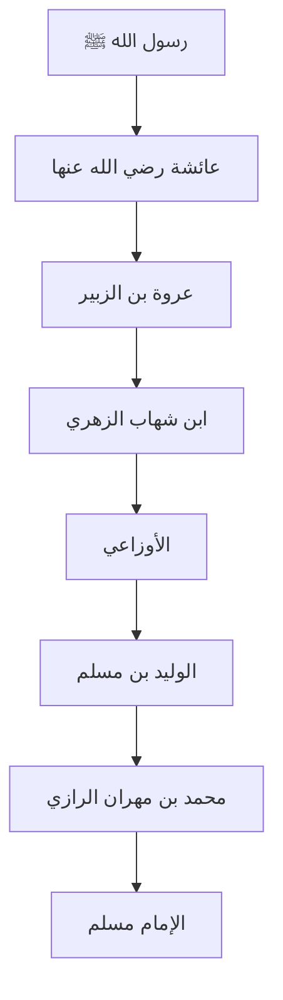

> ### المتن النبوي الشريف | صحيح مسلم (10:4)
> **درجة الحديث:** صحيح · متفق عليه
>
> «وَحَدَّثَنَا مُحَمَّدُ بْنُ مِهْرَانَ الرَّازِيُّ، حَدَّثَنَا الْوَلِيدُ بْنُ مُسْلِمٍ، قَالَ قَالَ الأَوْزَاعِيُّ أَبُو عَمْرٍو وَغَيْرُهُ سَمِعْتُ ابْنَ شِهَابٍ الزُّهْرِيَّ، يُخْبِرُ عَنْ عُرْوَةَ، عَنْ عَائِشَةَ، أَنَّ الشَّمْسَ، خَسَفَتْ عَلَى عَهْدِ رَسُولِ اللَّهِ صلى الله عليه وسلم فَبَعَثَ مُنَادِيًا "الصَّلاَةَ جَامِعَةً" فَاجْتَمَعُوا وَتَقَدَّمَ فَكَبَّرَ، وَصَلَّى أَرْبَعَ رَكَعَاتٍ فِي رَكْعَتَيْنِ وَأَرْبَعَ سَجَدَاتٍ.»
>
> **التوثيق الأكاديمي المعتمد:** أخرجه مسلم في كتاب الكسوف، باب صلاة الكسوف، حديث رقم 4، من حديث عائشة رضي الله عنها.

* **الصحابي:** عائشة بنت أبي بكر الصديق رضي الله عنها.
* **الكنية واللقب:** أم المؤمنين، الصديقة بنت الصديق.
* **سنة ومكان الوفاة:** 57 هـ • المدينة المنورة، ودفنت بالبقيع.
* **مروياتها في السنة:** من المكثرات من الرواية، ولها نحو 2210 حديثًا.
* **سياق رواية الحديث:** صلاة الكسوف حين نودي: «الصلاة جامعة».

عائشة بنت أبي بكر — (أم المؤمنين، صحابية جليلة)

* **الطبقة والبلد:** من كبار الصحابة • المدينة.
* **أقوال الجرح والتعديل:** مجمع على عدالتها، وهي من أوعية العلم والفقه.
* **دورها في الإسناد:** الصحابية الراوية للحديث.

عروة بن الزبير — (ثقة فقيه)

* **الطبقة والبلد:** من كبار التابعين • المدينة.
* **أقوال الجرح والتعديل:** إمام ثقة حجة، من فقهاء المدينة السبعة.
* **دوره في الإسناد:** يروي عن عائشة.

محمد بن شهاب الزهري — (ثقة حافظ)

* **الطبقة والبلد:** من أتباع التابعين • الحجاز ثم الشام.
* **أقوال الجرح والتعديل:** حافظ متقن، إمام في الحديث.
* **دوره في الإسناد:** يروي عن عروة.

الأوزاعي — (إمام ثقة)

* **الطبقة والبلد:** من أتباع التابعين • الشام.
* **أقوال الجرح والتعديل:** إمام حافظ، ثقة ثبت.
* **دوره في الإسناد:** يروي عن الزهري.

الوليد بن مسلم — (ثقة كثير التدليس)

* **الطبقة والبلد:** من أتباع أتباع التابعين • الشام.
* **أقوال الجرح والتعديل:** ثقة في نفسه، إلا أنه معروف بالتدليس والتسوية.
* **دوره في الإسناد:** يروي عن الأوزاعي.

محمد بن مهران الرازي — (ثقة)

* **الطبقة والبلد:** من أتباع أتباع التابعين • الري.
* **أقوال الجرح والتعديل:** صدوق ثقة.
* **دوره في الإسناد:** يروي عن الوليد بن مسلم.

الإمام مسلم بن الحجاج — (الإمام الحافظ)

* **الطبقة والبلد:** من أئمة الحديث • نيسابور.
* **أقوال الجرح والتعديل:** إمام حافظ متفق على إمامته.
* **دوره في الإسناد:** المصنف الجامع للحديث.

* **المعنى الإجمالي والأحكام الفقهية:** الحديث أصلٌ في مشروعية النداء بـ«الصلاة جامعة» عند اجتماع الناس لأمرٍ مهم، ومنه صلاة الكسوف. وفيه مشروعية الجماعة، ورفع الصوت بالنداء، وأن صلاة الكسوف ركعتان في كل ركعة قيامان وركوعان وسجدتان.
* **معجم غريب الحديث وجذور الكلمات:**  
  * **خسفت**: من الجذر **خسف**، أي ذهب ضوءها أو تغيّر جرمها.  
  * **جامعة**: أي اجتمعوا لها.  
  * **فكبّر**: أي دخل في الصلاة بالتكبير.
* **Authentic English Translation (HadeethEnc):**
  > "A'isha reported that there was a solar eclipse during the lifetime of the Messenger of Allah (peace be upon him) and he sent the announcer (to summon them) for congregational prayer. The people gathered together and he pronounced takbir and he observed four rak'ahs, in the form of two rak'ahs and four prostrations."

يمكنك استخدام أزرار المتابعة التفاعلية أدناه لتخريج الحديث في بقية الكتب الستة أو رسم شبكة الأسانيد المجمعة.