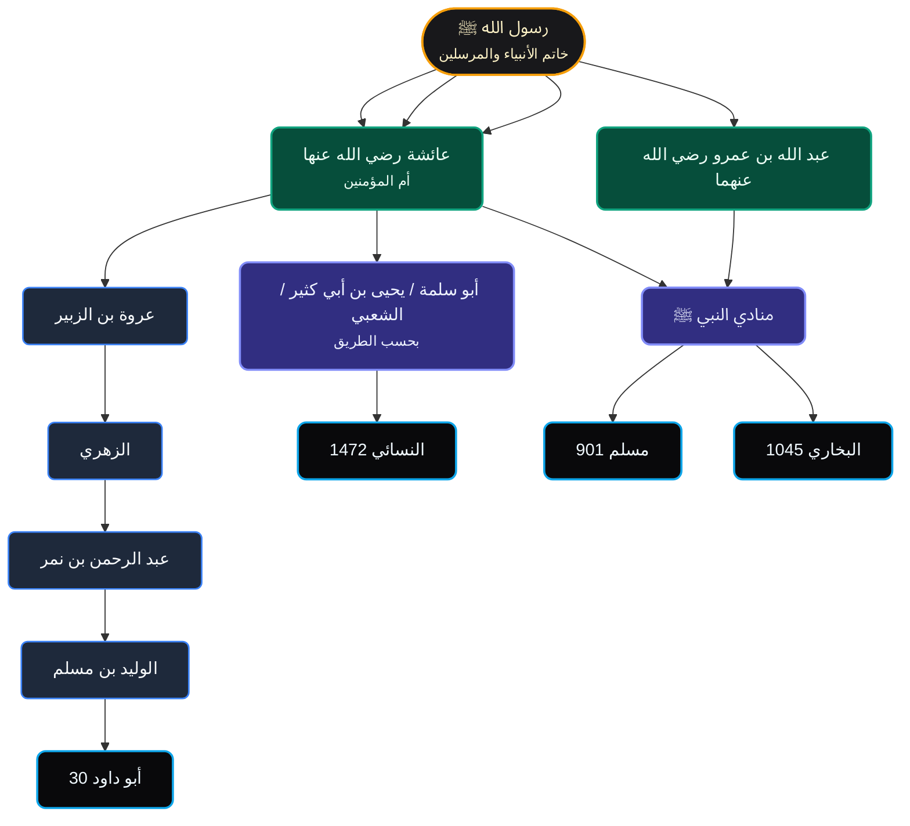

### تخريج الحديث في بقية الكتب الستة: **«الصلاة جامعة»**

**تنبيه منهجي مختصر:**  
اللفظ **«الصلاة جامعة»** يَرِد في أبواب متعددة، وأشهر مواضعه هنا:  
1. **صلاة الكسوف**  
2. **النداء للاجتماع في النوازل أو الخطب العامة**  
3. **النداء في العيدين عند بعض الروايات**

---

## 1) مصفوفة التخريج المقارنة في الكتب الستة

| الكتاب | الموضع/الحديث | الصحابي | اللفظ الوارد | الملاحظة |
|---|---:|---|---|---|
| **أبو داود** | 30 | عائشة | «فأمر رسول الله ﷺ رجلاً فنادى: أن الصلاة جامعة» | **أصل اللفظ المشهور** في الكسوف |
| **البخاري** | 1045 | عبد الله بن عمرو | «كان النبي ﷺ يأمر المؤذن في العيدين أن يقول: الصلاة جامعة» | **في العيدين** لا في الكسوف |
| **مسلم** | 901 | عائشة | «فنادى: الصلاة جامعة» | في **غزوة تبوك** عند أهل الحجر |
| **الترمذي** | — | — | لم أقف هنا على موضعٍ مطابقٍ بنفس اللفظ من نتيجة البحث المباشر | يحتاج تعيينًا أدق بالباب |
| **النسائي** | 1472 | عائشة | «فبعث مناديًا: الصلاة جامعة» | في **صلاة الكسوف** |
| **ابن ماجه** | — | — | لم يظهر في نتيجة البحث المباشر هنا | يحتاج بحثًا أوسع في الأبواب |

---

## 2) الفروق اللفظية بين الروايات

### أ) رواية الكسوف
- **أبو داود:**  
  «فأمر رسول الله ﷺ رجلاً فنادى: أن الصلاة جامعة»
- **النسائي:**  
  «فبعث مناديًا: الصلاة جامعة»

**الفارق:**  
- أبو داود نصّ على **رجلٍ بعينه**.
- النسائي عبّر بـ **مناديًا** بإطلاق.

### ب) رواية غزوة تبوك
- **مسلم:**  
  «فنادى: الصلاة جامعة»

**الفارق:**  
- هنا النداء ليس للكسوف، بل **لاجتماع الناس** بسبب أمرٍ مهم.

### ج) رواية العيدين
- **البخاري:**  
  «كان النبي ﷺ يأمر المؤذن في العيدين أن يقول: الصلاة جامعة»

**الفارق:**  
- هذه الرواية تُثبت استعمال اللفظ في **العيدين** أيضًا.

---

## 3) الخلاصة الحديثية
- لفظ **«الصلاة جامعة»** **ثابت صحيح** في الجملة.
- وهو **ليس مقصورًا على الكسوف**، بل ورد:
  - في **الكسوف**
  - وفي **العيدين**
  - وفي **الاجتماع لأمرٍ مهم** كما في تبوك
- وأقوى ما في الباب هنا:
  - **أبو داود 30**
  - **مسلم 901**
  - **البخاري 1045**
  - **النسائي 1472**

---

## 4) شبكة الأسانيد المجمعة
فيما يلي **شبكة مركزة** تُظهر مدار اللفظ في أشهر طرقه، مع تجنب خلط شيوخ المصنفين:

---

## 5) ملاحظة علمية دقيقة
النتيجة التي ظهرت من الأداة في **شجرة أبي داود 30** تضمنت **سلسلة إسناد خاصة بهذا الموضع**، لكن **اللفظ نفسه** له **طرق أخرى** في الصحيحين والسنن، ولذلك فالشبكة أعلاه **مجمعة للفظ** لا لطريق أبي داود وحده.

---

**خيارات المتابعة والتوسع في هذا الحديث:**
1. **تخريج الحديث في بقية الكتب الستة:** هل ترغب في جدولٍ أدقّ يضم نصوص الروايات كاملةً من كل كتاب مع الفروق اللفظية سطرًا بسطر؟
2. **شبكة الأسانيد المجمعة الموسعة:** هل ترغب في نسخة Mermaid أكبر تُظهر كل طريقٍ على حدة مع تمييز مدار الحديث والرواة المشتركة؟