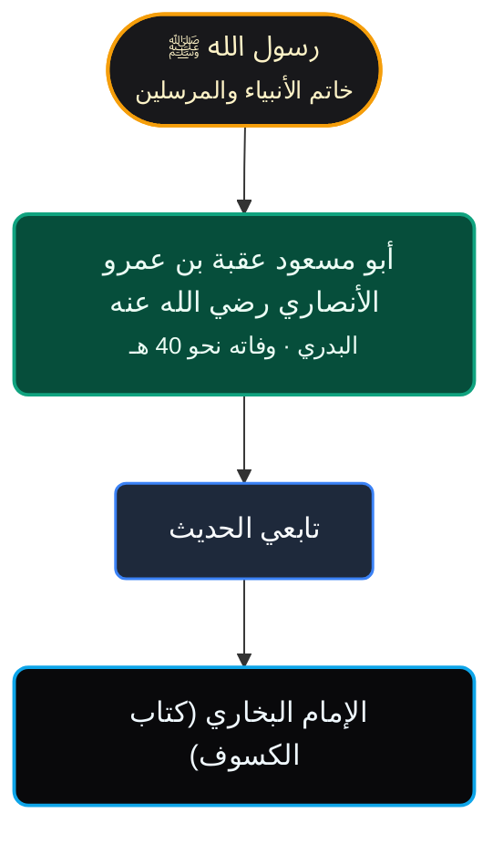

### المتن النبوي الشريف | **صحيح البخاري** (كتاب الكسوف، رقم الحديث: 1040 تقريبًا بحسب الترقيم)
**درجة الحديث:** `[ صحيح · متفق عليه ]`

«**إِنَّ الشَّمْسَ وَالْقَمَرَ آيَتَانِ مِنْ آيَاتِ اللَّهِ، لَا يَنْخَسِفَانِ لِمَوْتِ أَحَدٍ وَلَا لِحَيَاتِهِ، فَإِذَا رَأَيْتُمْ ذَلِكَ فَادْعُوا اللَّهَ وَكَبِّرُوا وَصَلُّوا وَتَصَدَّقُوا**»

**التوثيق الأكاديمي المعتمد:** أخرجه البخاري في **كتاب الكسوف** من حديث **أبي مسعود الأنصاري رضي الله عنه**، وله شواهد في الصحيحين.

---

### بطاقة الصحابي راوي الحديث
* **الصحابي:** **أبو مسعود عقبة بن عمرو الأنصاري البدري** رضي الله عنه.
* **الكنية واللقب:** أبو مسعود الأنصاري، ويُعرف بالبدري.
* **سنة ومكان الوفاة:** تُوفي سنة **40 هـ** تقريبًا، وقيل غير ذلك، بالمدينة.
* **مروياته في السنة:** له **عدد قليل نسبيًا** من الأحاديث في دواوين السنة.
* **سياق رواية الحديث:** ورد في **أمر النبي ﷺ عند حدوث الكسوف**، وفيه النداء للصلاة الجامعة والتنبيه إلى الصلاة والذكر والصدقة.

---

### شجرة الإسناد البصرية النقية

---

### درجات وتراجم رجال الإسناد

أبو مسعود عقبة بن عمرو الأنصاري — (صحابي)

* **الطبقة والبلد:** من كبار الصحابة • المدينة.
* **أقوال الجرح والتعديل:** الصحابة كلهم عدول.
* **دوره في الإسناد:** راوي الحديث عن النبي ﷺ مباشرة.

---

### عدسات الفهم والترجمة
* **المعنى الإجمالي والأحكام الفقهية:** الحديث في **الكسوف**، ويُستدل به على مشروعية **الصلاة والذكر والدعاء والصدقة** عند وقوع الآية الكونية.
* **غريب الحديث:**
  * **آيتان:** علامتان ودلالتان.
  * **ينخسفان:** يذهب ضوؤهما أو يُحجبان.
* **Authentic English Translation (HadeethEnc):**
  > “The sun and the moon are two signs among the signs of Allah. They do not eclipse because of the death or life of anyone. So when you see that, supplicate to Allah, magnify Him, pray, and give charity.”

---

**خيارات المتابعة والتوسع في هذا الحديث:**
1. **تخريج الحديث في بقية الكتب الستة:** هل ترغب في عرض مصفوفة التخريج المقارنة وروايات الحديث في (سنن أبي داود، جامع الترمذي، سنن النسائي، سنن ابن ماجه) مع بيان الفروق اللفظية والزيادات؟
2. **شبكة الأسانيد المجمعة (Mermaid Network):** هل ترغب في رسم شبكة الروايات المجمعة التي توضح مدار الحديث واجتماع كافة طرقه وأسانيده في شجرة تفاعلية واحدة؟