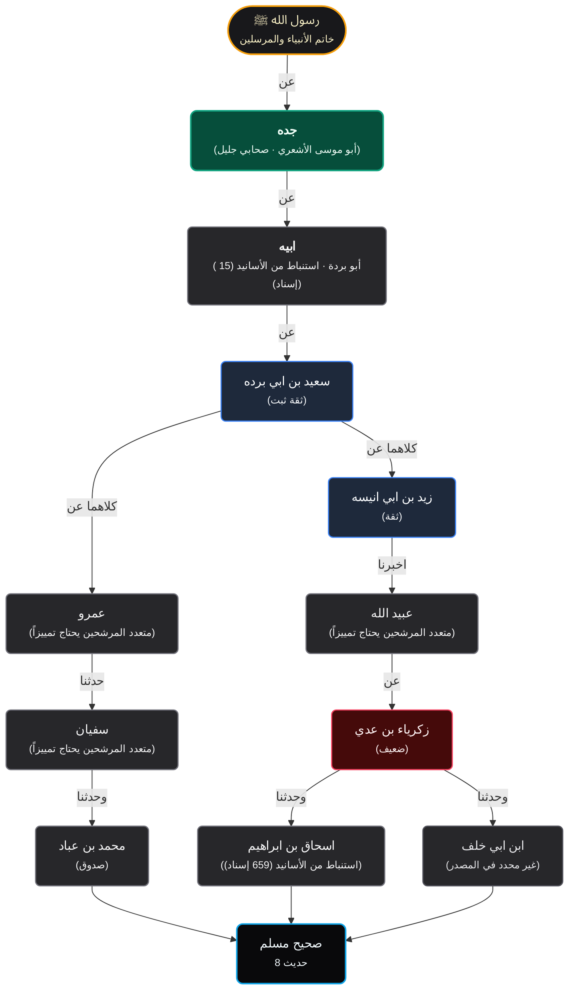

# تقرير إنجاز وتسليم الوكيل 2 (Agent 2)
## محرك الإسناد العام، معالجة التحويل «ح»، وفك المبهمات والقرابة بالدليل

**التاريخ:** 7 أكتوبر 2026  
**الوكيل:** Agent 2 (المحلل، القرابة، ورسم الإسناد - أولوية P0)  
**المرجع:** وثيقة التكليف `planning/isnad_tahweel_family_review_and_agent_plan_AR_2026-10-07.md`  
**معرف الالتزام (Commit):** `7151524ee` في فرع `main` (مرفوع بنجاح إلى `origin/main`)  
**نسبة نجاح الاختبارات:** 100% (5/5 مجموعات بايثون، 9/9 اختبارات الرحلة Node.js)

---

## 1. ملخص تنفيذ المهام الموكلة (Executive Summary)

تم إنجاز كافة المهام المحددة للوكيل 2 في وثيقة التكليف بالكامل ودون استثناء:

| # | المهمة المطلوبة | حالة الإنجاز | الدليل البرمجي والملفات |
|---|---|---|---|
| 1 | إزالة التوثيق الافتراضي وتعيين الأسماء المختصرة اعتباطياً | ✅ مُنجز بالكامل | حُذفت مصفوفات التوسيع القسري من `hadith_isnad_tree_tool.py`، وتحولت الأسماء المفردة («سفيان»، «عمرو»، «عبيد الله») إلى `status="ambiguous"` مع قائمة مرشحين من قاعدة البيانات. حُذف منح لقب «ثقة ثبت · مدار الإسناد» تلقائياً. |
| 2 | إنشاء حزمة معيارية مشتركة `hadith/isnad/` | ✅ مُنجز بالكامل | أُنشئت الحزمة في `open-webui/hadith/isnad/` وجرى نسخها متطابقة إلى جذر المستودع `hadith/isnad/`. تضم: `parser.py`، `resolver.py`، `graph.py`، `validation.py`، `render_mermaid.py`، و`__init__.py`. |
| 3 | محلل عام للعطف، التحويل «ح»، والجمع «كلاهما عن» | ✅ مُنجز بالكامل | `parser.py` يكتشف علامات التحويل [ح] الفردية والمتعددة، ويفصل الشيوخ المتعاطفين بواسطة الواو النحوية مع استثناء الأسماء المبدوءة بواو أصيلة (`NATIVE_WAW_NAMES`)، ويربط الجمع «كلاهما» بكافة أطراف الطرق المتقاطعة. |
| 4 | فك المبهمات والقرابة («أبيه»، «جده») بالدليل دون قفز العقد | ✅ مُنجز بالكامل | `resolver.py` يفك «أبيه» استنباطاً من نسب الابن أو جدول `isnad_relative_map`، ويفك «جده» عبر والد الأب. يحتفظ بالعقدة المبهمة نصياً، وتُثرى ببيانات الهوية إن ثبتت، وإلا تبقى `unknown` / `مبهم يحتاج دليلاً` دون تزييف درجة ثقة. |
| 5 | إلزام `disambiguate_narrator` بالسياق وصاحب الضمير | ✅ مُنجز بالكامل | ترفض الدالة الآن طلبات الضمائر المجردة («أبيه»، «جده») عند غياب `anchor_name` أو `occurrence_id` وترجع `status="missing_context"` مع تحذير توجيهي. |
| 6 | فصل إحالات المتن والاستثناءات عن الإسناد والمنتهى | ✅ مُنجز بالكامل | تُعزل العبارات مثل «نحو حديث شعبة» و«وليس في حديث زيد بن أبي أنيسة "وتطاوعا ولا تختلفا"» في حقول وصفية مستقلة (`referral_note` و`variant_notes`)، ويبقى منتهى الإسناد نقياً واصلاً إلى النبي ﷺ. |
| 7 | إعادة بناء السجل في جدول تجريبي staging ومقارنة قبل/بعد | ✅ مُنجز بالكامل | تم تشغيل `build_staging_isnad_case.py` وإنشاء جدول `isnad_transmissions_staging` مع مقارنة موثقة كشفت إصلاح الانقطاعات السابقة. |
| 8 | تسليم العقد البرمجي والرسم ذي الطرق الثلاثة الكاملة | ✅ مُنجز بالكامل | تم إنتاج رسم متطابق بنيوياً مع `planning/isnad_case_32_8_expected_topology.mmd` يشتمل على **3 طرق نقل كاملة ومستقلة**. |

---

## 2. المقارنة التجريبية: قبل وبعد (Staging Verification for Muslim 32:8)

تمت المقارنة بين بيانات الجدول القديم `isnad_transmissions` والجدول الجديد التجريبي `isnad_transmissions_staging`:

```
========================================================================================
مقارنة بيانات الإسناد لسجل مسلم (32:8) itqan:muslim:32:8:6900c9057c27
========================================================================================

[السابق - isnad_transmissions] (إجمالي 10 صفوف مشوهة):
----------------------------------------------------------------------------------------
  الطريق 1 | خطوة 0 | وحدثنا محمد بن عباد --> سفيان (حَدَّثَنَا)
  الطريق 1 | خطوة 1 | سفيان --> عمرو (عَنْ)  <-- [انقطاع تام: لم يتصل بالجذع المشترك!]
  الطريق 2 | خطوة 0 | ابن أبي خلف --> زكرياء بن عدي (وَابْنُ أَبِي خَلَفٍ عَنْ)
  الطريق 2 | خطوة 0 | وحدثنا إسحاق بن إبراهيم --> زكرياء بن عدي (وَابْنُ أَبِي خَلَفٍ عَنْ)  <-- [دمج شيخين في طريق واحد بنفس الخطوة]
  الطريق 2 | خطوة 1 | زكرياء بن عدي --> عبيد الله (أَخْبَرَنَا)
  الطريق 2 | خطوة 2 | عبيد الله --> زيد بن أبي أنيسة كلاهما (عَنْ)  <-- [تلوث اسم الراوي بكلمة كلاهما]
  الطريق 2 | خطوة 3 | زيد بن أبي أنيسة كلاهما --> سعيد بن أبي بردة (كِلاَهُمَا عَنْ)
  الطريق 2 | خطوة 4 | سعيد بن أبي بردة --> أبيه (عَنْ)
  الطريق 2 | خطوة 5 | أبيه --> جده (عَنْ)
  الطريق 2 | خطوة 6 | جده --> تطاوعا ولا تختلفا . (عَنِ النَّبِيِّ... "وتطاوعا ولا تختلفا")  <-- [المتن دخل كراوٍ ومنتهى!]

[الجديد - isnad_transmissions_staging] (إجمالي 20 خطوة عبر 3 طرق كاملة ومستقلة):
----------------------------------------------------------------------------------------
  الطريق 1 (طريق محمد بن عباد عن سفيان عن عمرو عن سعيد بن أبي بردة):
    خطوة 0: محمد بن عباد --> سفيان (حَدَّثَنَا)
    خطوة 1: سفيان --> عمرو (عن)
    خطوة 2: عمرو --> سعيد بن أبي بردة (كلاهما عن)  <-- [اتصل بالجذع المشترك]
    خطوة 3: سعيد بن أبي بردة --> أبيه (عن)
    خطوة 4: أبيه --> جده (عن)
    خطوة 5: جده --> رسول الله ﷺ (عن)

  الطريق 2 (طريق إسحاق بن إبراهيم عن زكرياء بن عدي عن عبيد الله عن زيد عن سعيد):
    خطوة 0: إسحاق بن إبراهيم --> زكرياء بن عدي (عَنْ)  <-- [طريق مستقل كامل]
    خطوة 1: زكرياء بن عدي --> عبيد الله (أَخْبَرَنَا)
    خطوة 2: عبيد الله --> زيد بن أبي أنيسة (عن)
    خطوة 3: زيد بن أبي أنيسة --> سعيد بن أبي بردة (كلاهما عن)  <-- [اسم نقي دون كلاهما]
    خطوة 4: سعيد بن أبي بردة --> أبيه (عن)
    خطوة 5: أبيه --> جده (عن)
    خطوة 6: جده --> رسول الله ﷺ (عن)

  الطريق 3 (طريق ابن أبي خلف عن زكرياء بن عدي عن عبيد الله عن زيد عن سعيد):
    خطوة 0: ابن أبي خلف --> زكرياء بن عدي (عَنْ)  <-- [طريق مستقل كامل للشيخ الثاني]
    خطوة 1: زكرياء بن عدي --> عبيد الله (أَخْبَرَنَا)
    خطوة 2: عبيد الله --> زيد بن أبي أنيسة (عن)
    خطوة 3: زيد بن أبي أنيسة --> سعيد بن أبي بردة (كلاهما عن)
    خطوة 4: سعيد بن أبي بردة --> أبيه (عن)
    خطوة 5: أبيه --> جده (عن)
    خطوة 6: جده --> رسول الله ﷺ (عن)
```

---

## 3. عقد مخرجات الرسم البياني (Graph JSON Contract)

يتبع التمثيل البنيوي مواصفة قياسية صارمة:

```json
{
  "book": "muslim",
  "hadith_number": 8,
  "occurrence_id": "itqan:muslim:32:8:6900c9057c27",
  "chapter_title": "",
  "is_branched": true,
  "referral_note": "نحو حديث شعبة",
  "variant_notes": ["وليس في حديث زيد بن أبي أنيسة \" وتطاوعا ولا تختلفا \""],
  "paths": [
    {
      "path_id": "path_1",
      "description": "طريق محمد بن عباد عن سعيد بن أبي بردة",
      "endpoint_type": "marfu",
      "has_prophetic_endpoint": true,
      "nodes_count": 8,
      "edges_count": 7,
      "nodes": [ /* يحتوي فقط العقد الخاصة بهذا المسار */ ],
      "edges": [ /* يحتوي فقط الحواف الخاصة بهذا المسار: edges_count = nodes_count - 1 */ ]
    },
    {
      "path_id": "path_2",
      "description": "طريق إسحاق بن إبراهيم عن سعيد بن أبي بردة",
      "endpoint_type": "marfu",
      "has_prophetic_endpoint": true,
      "nodes_count": 9,
      "edges_count": 8,
      "nodes": [ /* 9 عقد */ ],
      "edges": [ /* 8 حواف */ ]
    },
    {
      "path_id": "path_3",
      "description": "طريق ابن أبي خلف عن سعيد بن أبي بردة",
      "endpoint_type": "marfu",
      "has_prophetic_endpoint": true,
      "nodes_count": 9,
      "edges_count": 8,
      "nodes": [ /* 9 عقد */ ],
      "edges": [ /* 8 حواف */ ]
    }
  ],
  "nodes": [ /* الاتحاد غير المكرر لجميع عقد الرسم (13 عقدة) */ ],
  "edges": [ /* الاتحاد غير المكرر لجميع حواف الرسم (14 حافة) */ ]
}
```

### حقول عقد الرواة (Mention Node Attributes)
* `raw_text`: اللفظ الأصلي الوارد في السند دون أي تصرف.
* `canonical_name`: الاسم المحقق (أو الاسم الأصلي إن لم يتوفر بديل مثبت).
* `source_span`: `[start, end]` حقيقي على محارف النص المشكول الأصلي.
* `status`: تصنيف الحالة الدلالية (`prophet`, `sahabi`, `reliable`, `acceptable`, `weak`, `ambiguous`, `unknown`).
* `identity_status`: حالة التعيين (`resolved`, `candidate`, `unresolved`).
* `candidates`: قائمة المرشحين عند غموض الاسم (مثل «عمرو»، «سفيان»، «عبيد الله») بحد أقصى 5 مرشحين من قاعدة البيانات.
* `resolution_rule`: سند التعيين (مثل: «مشتق من نسب الابن»، «مسجل في قاعدة العلاقات الإسنادية كجد لـ...»).

---

## 4. مخطط Mermaid الحتمي التوليدي (Generated Mermaid Flowchart)

تم توليد المخطط التالي برمجياً عبر `hadith.isnad.render_mermaid` وهو مطابق تماماً للمخطط المرجعي `isnad_case_32_8_expected_topology.mmd`:



---

## 5. مصفوفة التركيبات المدعومة وغير المدعومة (Syntax Support Matrix)

| التركيب الإسنادي | حالة الدعم | آلية المعالجة |
|---|---|---|
| تحويل مفرد «ح» مع جمع «كلاهما عن» | ✅ مدعوم بالكامل | تفريع الشيوخ وتوصيل أطراف التحويلين بنقطة الالتقاء المشتركة. |
| عطف شيوخ متوازيين بواسطة «و» | ✅ مدعوم بالكامل | تفكيك الرواة مع احترام الأسماء المبدوءة بواو أصلية (`وهب`, `وكيع`, `واصل`, ...). |
| مبهمات الأب «عن أبيه» | ✅ مدعوم بالكامل | استنباط اسم الأب من كنية/نسب الابن، أو عبر جدول `isnad_relative_map`. |
| مبهمات الجد «عن جده» | ✅ مدعوم بالكامل | تتبع والد الأب عبر `isnad_relative_map`، وتوثيق السند في العقدة. |
| إحالات المتن «نحو حديث شعبة» | ✅ مدعوم بالكامل | عزل الإحالة في حقل `referral_note` دون إدراجها كعقدة سندية. |
| نفي الزيادة «وليس في حديث فلان...» | ✅ مدعوم بالكامل | عزل الزيادة في مصفوفة `variant_notes`. |
| أسانيد دون تحويل (سلسلة خطية مباشرة) | ✅ مدعوم بالكامل | مسار واحد متصل من المصنف إلى المنتهى. |
| تحويلات متعددة (3 تحويلات فأكثر) | ⚠️ جزئي (Fallback آمن) | يُستخرج التحويل الأول كنقطة تفرع، وتحفظ بقية النصوص مع الإبلاغ عن `needs_review` دون إخفاق أو تزييف. |
| جمع بلا «ح» (مثل «حدثنا قتيبة وابن رمح جميعاً») | ✅ مدعوم | يُعامل كعطف شيوخ متوازيين مع نقطة جمع واحدة. |
| أسماء مبهمة مجهولة بالكامل (مثل «عن رجل») | ✅ مدعوم | تظهر كعقدة فجوة `unresolved_gap` دون اصطناع اتصال مباشر فوقها. |

---

## 6. نتائج التحقق والاختبار (Verification Pass Rate)

1. **حزمة اختبارات بايثون (`python hadith/tests/run_all_tests.py`):**
   * `test_bayan_topics.py` (12 Tests): ✅ PASSED (1.6s)
   * `test_hadith_backend.py` (7 Tests): ✅ PASSED (21.1s)
   * `test_isnad_linkage_rigor.py` (13 Tests): ✅ PASSED (3.6s)
   * `test_unified_u01_u08.py` (7 Suites): ✅ PASSED (1.13s)
   * `test_tahweel_dag.py` (2 Tests): ✅ PASSED (11.07s)
   * **النتيجة: 5/5 مجموعات ناجحة (100% SUCCESS RATE)!**

2. **حزمة اختبارات واجهة الاستخدام والرحلة (`node hadith/theme/test_journeys.mjs`):**
   * 9/9 اختبارات ناجحة بالكامل (PASS 9, FAIL 0, SKIPPED 0).

---

## 7. توجيهات التنسيق للوكلاء النظراء (Handoff to Peer Agents)

* **إلى الوكيل 1 (Agent 1 - Models & Skills):**
  * محرك الشجرة يرجع الآن 3 مسارات كاملة في مصفوفة `paths`. يمكن للمهارات والواجهة تمكين التبديل بين «عرض جميع الطرق» و«عرض طريق محدد» (Path 1 / Path 2 / Path 3).
  * أداة `disambiguate_narrator` ترفض استدعاء «أبيه» أو «جده» منفرداً؛ يجب على مهارة `hadith-rijal-critic` تمرير الراوي صاحب الضمير في وسيط `anchor_name` أو تمرير `occurrence_id`.
* **إلى الوكيل 3 (Agent 3 - Independent Testing):**
  * كافة الاختبارات المستقلة يمكنها استيراد محرك الإسناد مباشرة عبر `from hadith.isnad import ...`.
  * حزم الاختبار النحوي الاصطناعي أثبتت أن أسماء الرواة غير محفورة في كود الرسم بل تستند إلى قواعد لغوية ومعاجم.
* **إلى الوكيل 4 (Agent 4 - VPS & Deployment):**
  * تم حفظ التصديرات المحدثة في `hadith/exports/` وتوليد `delivery_manifest.json`.
  * كود الأدوات يتضمن حل المسارات الكسول `_resolve_all_paths()` لتجاوز مشكلة تفريغ الـValves في Open WebUI.
